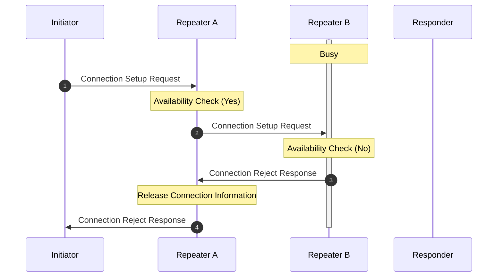
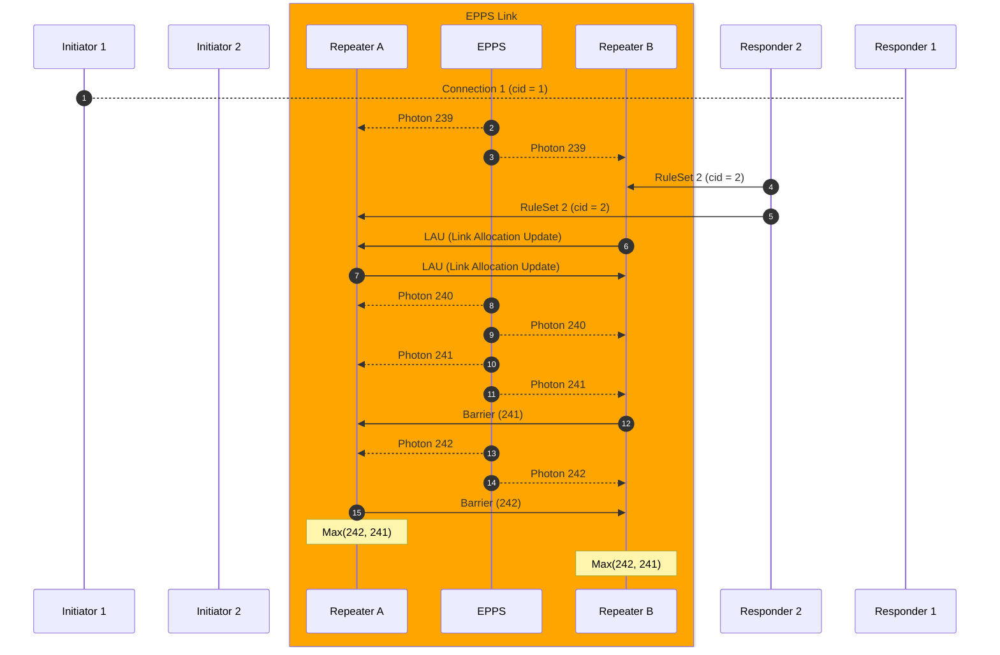
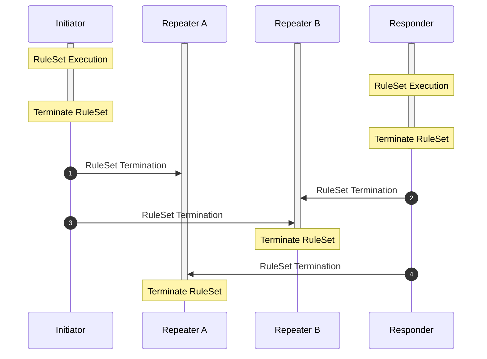
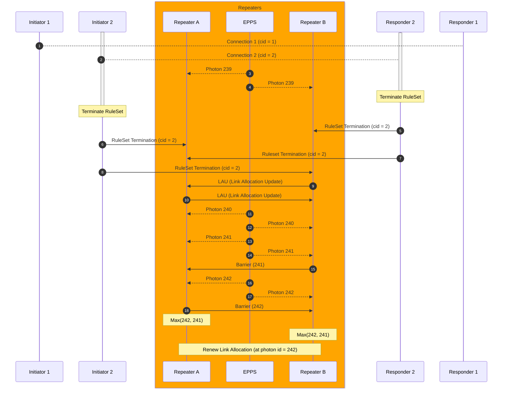

# Draft: Connection Setup and Teardown

> Authors: Ryosuke Satoh
> This is an updated version of [connection setup draft](https://datatracker.ietf.org/doc/html/draft-van-meter-qirg-quantum-connection-setup-01)

- [Draft: Connection Setup and Teardown](#draft-connection-setup-and-teardown)
  - [Abstract](#abstract)
  - [1. Introduction](#1-introduction)
  - [2. Terminology](#2-terminology)
  - [3. Preliminaries](#3-preliminaries)
    - [3.1 Quantum Recursive Network Architecture](#31-quantum-recursive-network-architecture)
    - [3.2 Routing](#32-routing)
  - [4. Connection Setup](#4-connection-setup)
    - [4.1 Connection Setup Phases](#41-connection-setup-phases)
    - [4.2 Connection Setup Request and Performance Indicators](#42-connection-setup-request-and-performance-indicators)
    - [4.3 RuleSet](#43-ruleset)
    - [4.4 Connection Setup Response](#44-connection-setup-response)
    - [4.5 Link Resource Allocation Update](#45-link-resource-allocation-update)
    - [4.6 RuleSet Execution](#46-ruleset-execution)
    - [4.7 Connection Setup Rejection](#47-connection-setup-rejection)
    - [4.8 Null connection setup request](#48-null-connection-setup-request)
    - [4.9 Connection Setup Example in single network](#49-connection-setup-example-in-single-network)
  - [5. Connection Teardown](#5-connection-teardown)
    - [5.1 Connection Teardown Phases](#51-connection-teardown-phases)
    - [5.2 RuleSet Termination](#52-ruleset-termination)
    - [5.3 Teardown Link Allocation Update](#53-teardown-link-allocation-update)
    - [5.4 Free Terminated Resources](#54-free-terminated-resources)
    - [5.5 Expected RuleSet Termination](#55-expected-ruleset-termination)
    - [5.3 Unexpected RuleSet Termination](#53-unexpected-ruleset-termination)
  - [6. Message Contents and Elements](#6-message-contents-and-elements)
    - [6.1 Connection Setup Request](#61-connection-setup-request)
    - [6.2 Performance Indicator](#62-performance-indicator)
    - [6.3 Connection Setup Reject](#63-connection-setup-reject)
    - [6.4 Connection Setup Response](#64-connection-setup-response)
    - [6.5 Connection Teardown Request](#65-connection-teardown-request)
    - [6.6 RuleSet](#66-ruleset)
    - [6.7 Link Allocation Update (LAU)](#67-link-allocation-update-lau)
    - [6.8 Barrier](#68-barrier)
  - [7. Service Configuration](#7-service-configuration)
    - [7.1 Primary TCP port number for connection setup request](#71-primary-tcp-port-number-for-connection-setup-request)
  - [8. Security Considerations](#8-security-considerations)
  - [References](#references)


## Abstract
To perform quantum application over quantum network, the very first step is to establish a connection between two or more participant end nodes. Establishing connection in quantum network may require more information compared to a classical network, especially for near-term quantum networking, which is fragile to loss and noise of quantum system. This document specifies how end nodes in quantum network establish connection between them and teardown the established connection after they used it.

## 1. Introduction
<!-- Introduction for Connection Setup-->
Quantum Communication aims to exchange quantum information over distant quantum computers to perform large-scale quantum computation, secret sharing, and various kinds of quantum applications. Establishing a connection across a quantum network [^KIM2008] is the first fundamental classical task for running a quantum network application. However, due to the photon loss and fragility of the quantum information, quantum communication between two (or more) end nodes requires coordinated computation among the set of quantum repeaters on the path, rather than the current store-and-forward network session [^VAN2014].

<!-- Introduction to RuleSet -->
The various properties of the repeater and quantum link must be properly taken into account when creating instructions for quantum repeaters. RuleSet is a flexible representation for instructing quantum repeaters based on the noise, loss and other properties they provide.

<!-- Things to be explained -->
In this document, we discuss the properties to be provided for creating RuleSet and how that information is accumulated in the connection setup process. Additionally, we discuss how the RuleSets are created and distributed to quantum repeaters.

<!-- Note -->
The discussion in this document is limited to the two-party connection setup process. Multipartite connection setup is left for further discussion.


## 2. Terminology
The following terms will be used (Lexical order):

**Bell pair**

A two qubit maximally entangled state that can be used to send quantum information. 

**End node**

A quantum network node that has one interface to make entanglment. An end node may have stationary quantum memory that is capable of storing quantum state or may only have a measurement device to read out quantum information.

**Entanglement**

Multiple qubits (mainly two qubits in this document) state are entangled means that there are correlations between those qubits and those correlated qubits does not change their state independently.

**Entanglement Swapping**

Entanglement swapping is a technique that teleports entanglement and get a longer entangled state by consuming two relatively shorter entangled states.

**Fidelity**

Fidelity is a metric that represents how close the quantum state is to the ideal state. The fidelity can be 0 to 1 and the state is exactly ideal when the fidelity is 1.

**Initiator**

Initiator is an end node quantum computer that demands quantum network and internet services.

**Repeater**

Quantum Repeater is a device that has two outbound QNIC interfaces.

**Responder**

Responder is an end node quantum computer that provides quantum network application services.

**Router**

Quantum Router is a device that has more than two outbound QNIC interfaces that could switch the route from Initiator to Responder.

**Quantum Network Interface Card (QNIC)**

QNIC is a deivce that stores a set of communication qubits and controllers of them.

**Qubit**

Qubit is a unit of information and sometimes refers to physical devices that stores one bit of quantum data. Qubit is also used as a carrier of quantum information.

**Quantum Node**

Quantum Node represents either quantum repeater, quantum router or end ndoes.

## 3. Preliminaries
### 3.1 Quantum Recursive Network Architecture
Quantum Recursive Network Architecture (QRNA) [^VAN2011] is a quantum network architecture inspired by a Recursive Network Architecture (RNA) [^TOU2008]. QRNA assumes the existence of layers that support a unified meta protocol which can be used to define quantum network protocols in different layers.
QRNA allows hiding complex lower layer network topologies from higher topologies.


### 3.2 Routing
Before establishing the connection between two end nodes, the network nodes properly identify which path(s) is good enough to support the application. The routing is out of scope of the connection setup, however, it is necessary to determine the route from Initiator to Responder with several properties such as the entanglement generation time, entanglement fidelity into consideration [^VAN2013].


## 4. Connection Setup

### 4.1 Connection Setup Phases
<!-- Overview of connection setup -->
The single-network, two-node connection setup procedure consists of three phases:
1.` Connection Setup Request Phase`: The outbound request is routed from Initiator to Responder using a standard NextHop-based forwarding table, accumulating information about the path along the way in a stack of Performance Indicators.
2.` RuleSet Creation Phase`: When the request arrives at the Responder, the Responder uses that information to create a complete RuleSet for every node. The RuleSets are assembled into a stack with the nearest node at the top.
3.` Connection Setup Response Phase`: The RuleSets are sent back along the original path, with each node removing its RuleSet from the message (popping the stack), then forwarding the remaining QCaps on until it returns to the Initiator.

The multi-network, two-node connection setup procedure contains one additional step.
4.` RuleSet Rewrite Phase`: When a RuleSet arrives at the interface node in different network, that node is responsible for rewriting RuleSet for quantum repeaters in subnet. In other words, the higher layer node that receives RuleSet creates RuleSets for lower layer nodes.

### 4.2 Connection Setup Request and Performance Indicators
<!-- Requesting Connection and stacking performance properties of memory and link -->
The first step of connection setup is issueing `Connection Setup Request` for Responder. This request contains a comprehensive set of information regarding application and its performance requirements. Additionally, the request packet includes the routed path information from Initiator to Responder.

After creating connection setup request packet, it is transmitted to the next hop quantum repeater. This quantum repeater provides `Performance Indicators` such as the fidelity of link-level Bell pair between previous hop quantum node (The Initiator in this case) and generation rate of it. Furthermore, it offers hardware calibration result which indicates the performance of gate operation, measurement operation, memory lifetime and other relevant factors. 

The request packet traverses the entire path, collecting performance indicators from each quantum repeater it encounters, until it finally reaches the Responder.


### 4.3 RuleSet
<!-- Creating RuleSet based on provided information -->
*RuleSet* [^MAT2019] is a collection of instructions for intermediate quantum repeaters and routers. It consists of a set of *Rules*, each comprising a *Condition* and an *Action*. RuleSet works similary to match-action style protocols such as OpenFlow [^MCK2008]. A rule could have one or multiple condition clauses about the status of resources, messages as a Codition. Once all the condition clauses are satisfied, the corresponding action clauses in an Action are performed. Some possible condition clauses and action clauses are outlined in a architectual proposal by Van Meter et al. [^VAN2022]. 

One RuleSet is created for one quantum repeater/router or end nodes (Initiator/Responder) so that the number of RuleSets is the same as the number of quantum nodes in the path.

In order to gurantee the consistency between RuleSets, Responder creates all the RuleSets along the quantum nodes in the path.

### 4.4 Connection Setup Response
<!-- Wrap up RuleSet and distribute -->
When a new connection is established and an old connection is terminated, resource allocation must be properly updated in link level. This resource allocation policy must be negotiated and shared between RuleEngine at both ends of the link. When repeaters receive a new RuleSet or Connection Termination message, they send Link Allocation Update (LAU) message to start negotiating process with counterpart repeater.

After they agree on a new link allocation, they exchange Barrier message to specify the time at which they switch from the curernt Link Allocation to negotiated Link Allocation.

### 4.5 Link Resource Allocation Update
<!--  -->

### 4.6 RuleSet Execution
<!-- May not need this -->

### 4.7 Connection Setup Rejection
>⚠️ What's the rejection policy -> depends on mux scheme?
> The possibility of rejection should be eliminated in the routing process?

If one of the intermediate repeaters is not capable of supporting the requested connection, the intermediate repeater must notify the `Initiator` that the connection cannot be established at that time. That response is notified to the initiator and the initiator should have choices to wait for some amount of time and restart the connection setup or completely discard the connection setup information and notify application failure to users.

In the case where the intermediate repeater `Repeater B` reject the connection setup request from the Initiator.

In this example, Responder B is busy for other connection and it is hard to provide enough number of resources to the new connection. This rejection policy depends on the resource allocation and multiplexing policy of the link.

When the `Repeater B` receives the Connection Setup Request, `Repeater B` checks if there is available resource to this connection. If there is available resource to the connection, forward the request with the node information. Otherwise, `Repeater B` sends back `Connection Setup Reject` to `Repeater A` and this `Connection Setup Reject` is forwarded to the initiator.

> Does this contain information such as estimated availble time or etc?

`Connection Setup Reject` contains estimated time information that the link would become available for the connection.


### 4.8 Null connection setup request
>Null Setup Request (NSR): NSR is used to test the E2E connection setup process, but no reservation is made.  Link information is collected as request goes from Initiator to Responder.  A normal Connection ID is created by the Initiator, but the request is for rate zero and fidelity >= 0.  The Responder replies with Null RuleSets sent to each node in the path.  All nodes log the request, but do not change Link Allocation or other resource allocation, and do not set up a connection.

### 4.9 Connection Setup Example in single network

The following diagram shows an example connection setup phase in a single network.
<details open>
<summary> Sequence diagram </summary>


</details>

Initiator creates `Connection Setup Request (CSR)` message which contains information of application that Initiator wants to perform. Initiator also provides criteria for the available resource and time consumptions. Initiator sends this request to the neighbor quantum repeater with interface and link information.

Intermediate quantum repeaters provide their informaiton and relay the Connection Setup Request to the Responder. Eventually, CSR is unpacked in the Responder and the information that intermediate repeaters provide is extracted.

Responder uses the extracted information to create RuleSets which contains a set of instructions for end nodes (Initiator/Responder) and intermediate quantum repeaters. Responder distributes generated RuleSets as `Connection Setup Response` which acknowlege the CSR. When end nodes and intermediate repeaters receive RuleSet, they start negotiation process to choose how to assign remaining resources and when to start the process. This process is done by `Link Allocation Update` message and `Barrier` message.


The following diagram shows detailed LAU and Barrier processes.

`Link Allocation Update (LAU)` contains a set of information to make a new policy for link resource allocation. This policy must be agreed on both sides of the link.
> Describe agreement process closely

After both repeater agree on a new policy, they have to descide when they activate a new policy. `Barrier` message tells the counterpart repeater the earliest index of resource. In the example above, Repeater B tells resource 241 is the next available resource for a new connection. However, Repeater A tells resource 242 is the next available resource. To properly align the assigning resource beteween Repeater A and B, they take `Max` of the given resource indices and choose when they switch from old link allocation policy to a new link allocation policy.


## 5. Connection Teardown
### 5.1 Connection Teardown Phases
- `RuleSet Termination Phase`: Terminating RuleSet at the end node.
- `Link Allocation Update Phase`: Updating link resource allocation policy
- `Free Terminated Resource Phase`: Free unused but no longer used resources

### 5.2 RuleSet Termination


### 5.3 Teardown Link Allocation Update

### 5.4 Free Terminated Resources

### 5.5 Expected RuleSet Termination
At the end of the RuleSet execution, both end nodes have to properly terminate the process in intermediate quantum repeaters.



When multiple connections are sharing the same link, the link allocation policy must properly transition from `k` to `k-1` connections.
The following diagram shows the transition from two connections to one connection.




### 5.3 Unexpected RuleSet Termination
RuleSet execution could be terminated by critical operational errors (server down, etc.)

## 6. Message Contents and Elements

### 6.1 Connection Setup Request
`Connection Setup Request` contains following information.

- Path Information
Address or labels for Responder and Intermediate Repeaters that identify the path from Initiator to Responder.

- Application Information [^WEH2018]
> Is this simillar to stages of quantum internet development?

- Performance requirements
A minimum requirements for the link-level entanglement generation performance such as fidelity of generated Bell pairs and throughput.

<details open>
<summary> Connection Setup Request Schema</summary>

```json
{
  "title": "Connection Setup Request",
  "description": "A message to request to establish a connection between Responder",
  "type": "object",
  "required": [
    "pathInformation",
    "classOfService",
    "performanceRequirements"
  ],
  "properties": {
    "pathInformation": {
      "type": "array",
      "minItems": 0,
      "items": {
        "type": "string",
        "required": ["host_name"]
      }
    },
    "classOfService": {
      "type": "object",
      "properties": {
        "application_id": {
          "type": "string"
        },
        "application_type": {
          "enum": ["prepare_measure", "store_use"]
        },
        "num_estimated_e2e_entanglement": {
          "type": "number"
        }
      }

    },
    "performanceRequirements": {
      "type": "object",
      "properties": {
        "fidelity_threshold": {
          "type": "number"
        },
        "generation_rate": {
          "type": "number"
        }
      }
    }
  }
}

```

</details>

### 6.2 Performance Indicator

- Raw Entanglement Generation Rate

- Calibration Result

<details open>
<summary> Performance Indicator Schema</summary>

```json
{
  "title": "Performance Indicator",
  "description": "Indicators of link and node performance",
  "type": "object",
  "required": ["rawEntanglementGenerationRate", "calibrationResult"],
  "properties": {
    "rawEntanglementGenerationRate": {
      "type": "number"
    },
    "calibrationResult": {
      "type": "object",
      "properties": {
        "rawEntanglementFidelity": {
          "type": "number",
          "resource_type": {"enum": ["PsiP", "PsiM", "PhiP", "PhiM"]}
        },
        "calibrationResult": {
          // Informaiton we need for estimating fidelity after purification and QEC
        }
      }
    }
  }
}
```
</details>

### 6.3 Connection Setup Reject
- Reason code
why the connection setup is rejected (error, busy, unauth etc?)
- Estimated next available
This tell the initiator when the link would be available (What if there are multiple bottle neck?)

<details open>
<summary> Connection Setup Reject Schema</summary>

```json
{
  "title": "Connection Setup Reject",
  "description": "Rejection of Connection Setup in the intermediate node or end node",
  "type": "object",
  "required": ["reasonCode"],
  "properties": {
    "reasonCode": {
      {"enum": ["BUSY", "ERROR", "UNKNOWN"]}
    },
    "estimatedNextAvailable": {
      "type": "number"
    }
  }
}
```

</details>

### 6.4 Connection Setup Response
The responder needs to tell the initiator the request arrival to start entanglement generation and consumption.

- RuleSet
- 

<details>
<summary> Connection Setup Response Schema </summary>

```json
{
  "title": "Connection Setup Response",
  "description": "Response of Connection Setup Request containing RuleSet",
  "type": "object",
  "required": ["ruleset"],
  "properties": {
    "ruleset": {
      "type": "array",
      "rulesets": [
        // RuleSet here
      ]
    }
  }
}
```

</details>

### 6.5 Connection Teardown Request
> Describe connection teardown request contents

Connection Teardown Request contains identifier of the connection to be terminated.

<details>
<summary> Connection Teardown Request</summary>

```json
{
  "title": "Connection Teardown Request",
  "description": "Request for tearing down established connection",
  "type": "object",
  "required": ["terminatedConnectionId"],
  "properties": {
    "terminatedConnectionId": {
      "type": "string",
    }
  }
}
```

</summary>
</details>


### 6.6 RuleSet
A RuleSet contains a set of rules that tells quantum network nodes what to do. One RuleSet is composed of metadata and a set of stages that contains a set of rules.
> where are RuleSets defined? Reference that here.


### 6.7 Link Allocation Update (LAU)
When a new connection is added or eliminated from the network, the resource allocation might be changed. For example, in the case where two connections are competing for the use of one single link, the resources might be evenly distributed or distributed based on some algorithm. After one of the two connections has completed its entanglement generation, all of the resources are shifted into the remaining connection. During this transition, the link must properly recognize that the allocation rule has changed and this change must be shared with the neighboring node to maintain the consistency of the resource allocation.

If this link allocation (LA) transition is handled improperly, communications can be disrupted for all connections sharing the link. The scenario to be avoided is inconsistent allocation of resources at the two ends of the link.
A problem occurs if one link end allocates its share of the resource to one connection while the other end of the link allocates its share of the resource to another connection. In this case, the two RuleSets operating at the two link ends will have inconsistent views of the set of available resources, and will make inconsistent decisions that result in failure to create the E2E resources properly. In the worst case, all connections passing through the link can fail: if one end allocates resources to connections A, B and C in the sequence ABABABCABCAB as connection C starts, but the other end allocates in the sequence ABABAABCABCA, then all subsequently generated resources will be allocated improperly and all three connections will fail. Recovery from this failure will be difficult.

LAU contains the following information.

- Terminating Connection Info
Quantum repeaters at both ends agree with which connection is terminated
- Allocation start info
From remaining connection, repeaters have to choose which connection they allocate the next resource

### 6.8 Barrier
Barrier specifies the time at which the link switches from the current Link Allocation (LA) to the negotiated LA. It must come after the negotiation for the new LA is complete. For MSM links, as shown in the previous diagram, the Barrier value is the Photon Pair Trial Sequence Number (PPTSN) for the link. The PPTSN is defined by the EPPS. For MIM links, the PPTSN is defined by the BSA. For MM links, for consistency, it should be defined by the receiving end.


## 7. Service Configuration
### 7.1 Primary TCP port number for connection setup request
Responder node is listening Initiator's request at 52244 port.


## 8. Security Considerations
TBD


## References
[^KIM2008]: Kimble, H. Jeff. "The quantum internet." Nature 453.7198 (2008): 1023-1030.
[^VAN2014]: Van Meter, R., "Quantum Networking", Wiley-iSTE , 2014.
[^MAT2019]: Matsuo, Takaaki, Clément Durand, and Rodney Van Meter. "Quantum link bootstrapping using a RuleSet-based communication protocol." Physical Review A 100.5 (2019): 052320.
[^VAN2013]: Van Meter, Rodney, et al. "Path selection for quantum repeater networks." Networking Science 3 (2013): 82-95.
[^VAN2013]: Van Meter, Rodney, et al. "Path selection for quantum repeater networks." Networking Science 3 (2013): 82-95.
[^VAN2022]: Van Meter, Rodney, et al. "A quantum internet architecture." 2022 IEEE International Conference on Quantum Computing and Engineering (QCE). IEEE, 2022.
[^VAN2011]: Van Meter, Rodney, Joe Touch, and D. Horsman. "Recursive quantum repeater networks." arXiv preprint arXiv:1105.1238 (2011).
[^MCK2008]: McKeown, Nick, et al. "OpenFlow: enabling innovation in campus networks." ACM SIGCOMM computer communication review 38.2 (2008): 69-74.
[^TOU2008]: Touch, Joseph D., and Venkata K. Pingali. "The RNA metaprotocol." 2008 Proceedings of 17th International Conference on Computer Communications and Networks. IEEE, 2008.

[^WEH2018]: Wehner, Stephanie, David Elkouss, and Ronald Hanson. "Quantum internet: A vision for the road ahead." Science 362.6412 (2018): eaam9288.
