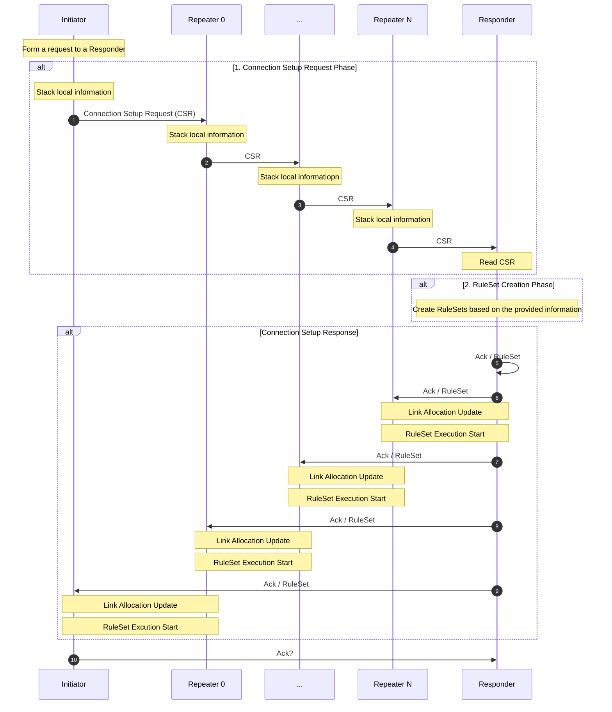
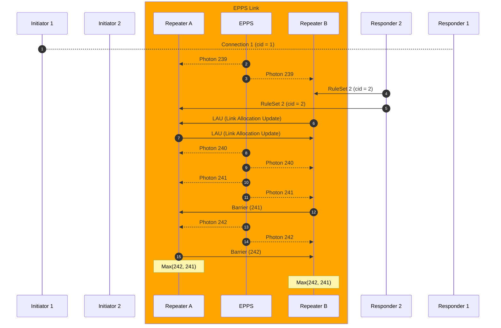
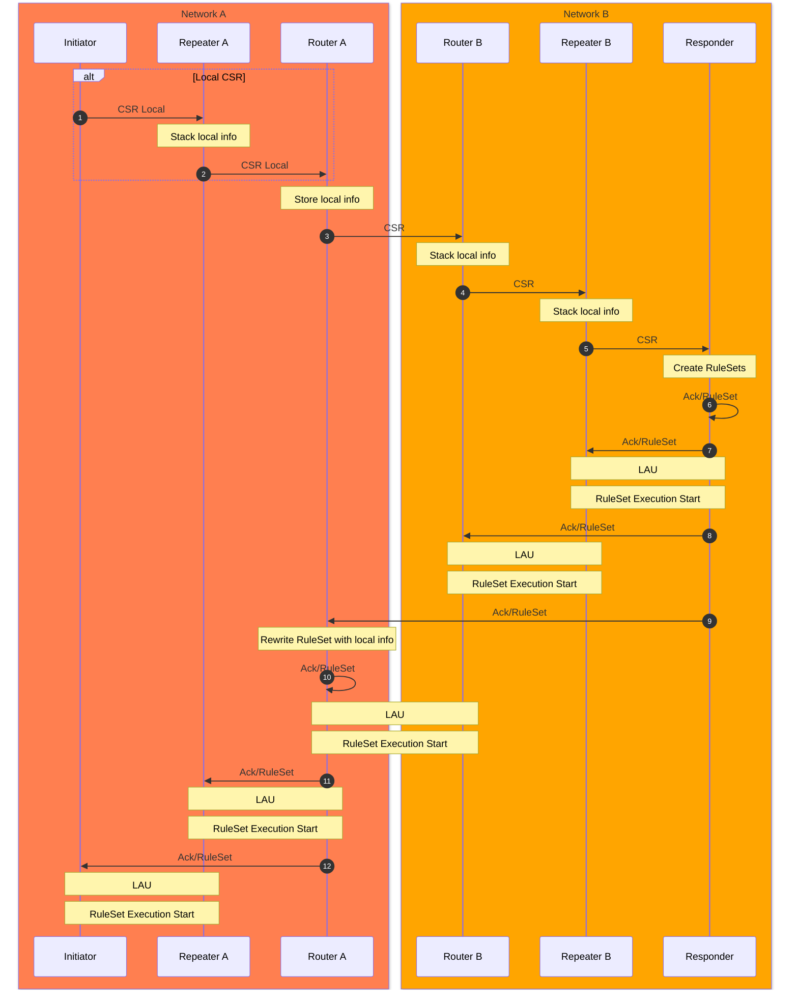
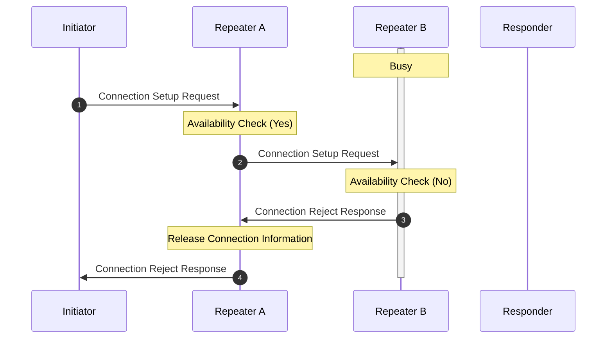
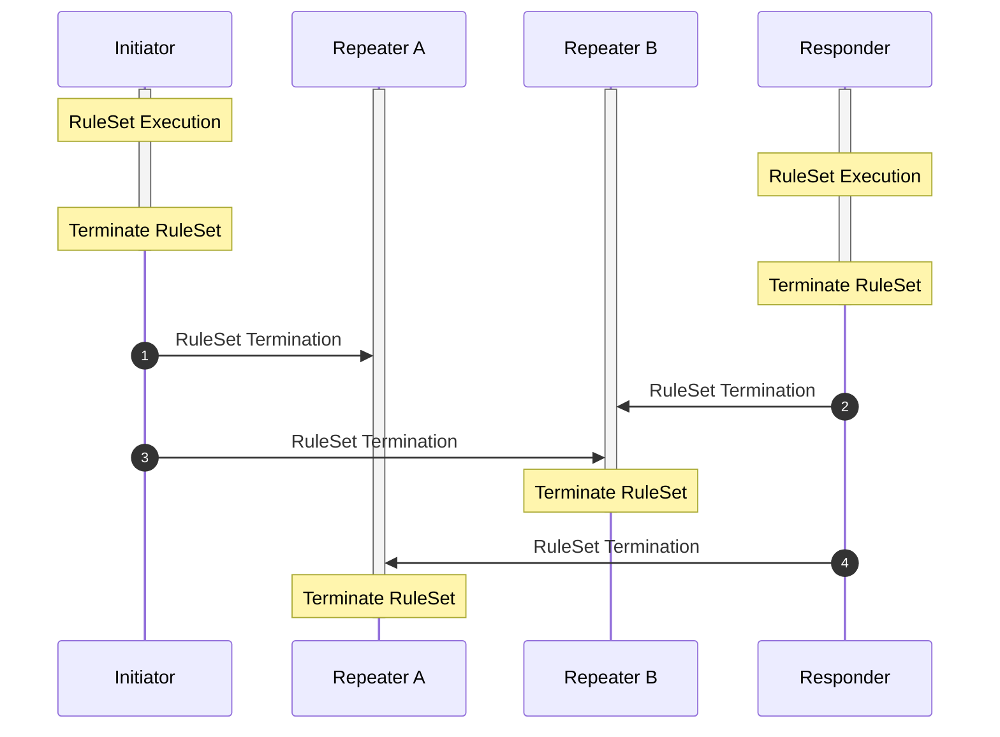
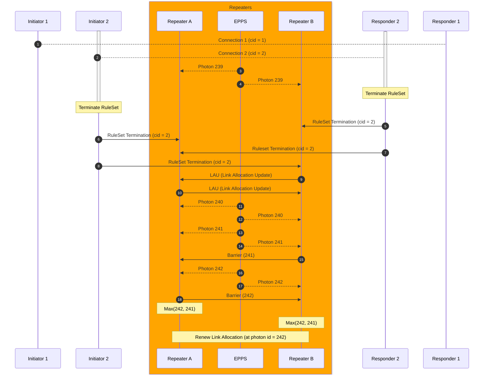

# Connection Setup
- [Connection Setup](#connection-setup)
  - [Abstract](#abstract)
  - [1. Introduction](#1-introduction)
  - [2. Concepts and Glossary](#2-concepts-and-glossary)
  - [3. Preliminaries](#3-preliminaries)
    - [3.1 Quantum Recursive Network Architecture](#31-quantum-recursive-network-architecture)
    - [3.2 Routing](#32-routing)
  - [4. Connection Setup](#4-connection-setup)
    - [4.1 Connection Setup Phases](#41-connection-setup-phases)
    - [4.2 Connection Setup in single network](#42-connection-setup-in-single-network)
    - [4.3 Connection Setup over multiple networks](#43-connection-setup-over-multiple-networks)
    - [4.4 Connection Setup Rejection](#44-connection-setup-rejection)
    - [4.5 Link Allocation Policy](#45-link-allocation-policy)
  - [5. Connection Teardown](#5-connection-teardown)
    - [5.1 RuleSet Termination](#51-ruleset-termination)
  - [6. Message Contents and Elements](#6-message-contents-and-elements)
    - [6.1 Connection Setup Request](#61-connection-setup-request)
    - [6.2 Quantum Capability (QCap)](#62-quantum-capability-qcap)
    - [6.3 Connection Setup Reject](#63-connection-setup-reject)
    - [6.4 Connection Setup Response](#64-connection-setup-response)
    - [6.5 Connection Teardown Request](#65-connection-teardown-request)
    - [6.6 RuleSet](#66-ruleset)
    - [6.7 Link Allocation Update (LAU)](#67-link-allocation-update-lau)
    - [6.7 Barrier](#67-barrier)
    - [7. Conclusion](#7-conclusion)
  - [Reference](#reference)

## Abstract

## 1. Introduction

 Introduction 

In the context of quantum networking and internet, connection setup refers to the process of establishing a connection between two or more end nodes in a quantum network. This task is crucial because it allows for the transfer of quantum information and enables various quantum communication protocols.

To ensure reliable and efficient quantum communication, network nodes need to manage and allocate the available entanglement resources effectively especially for near-term quantum network that is extremely fragile to the noise and loss.

## 2. Concepts and Glossary
> Add this later

 Concepts 

The following terms will be used:

**Bell pair**

A two qubit maximally entangled state that can be used to send quantum information.

**End node**

A quantum network node that has one interface to make entanglment. An end node may have stationary quantum memory that is capable of storing quantum state or may only have a measurement device to read out quantum information.

**Entanglement**

Multiple qubits (mainly two qubits in this document) state are entangled means that there are correlations between those qubits and those correlated qubits does not change their state independently.

**Entanglement Swapping**

Entanglement swapping is a technique that teleports entanglement and get a longer entangled state by consuming two relatively shorter entangled states.

**Fidelity**

Fidelity is a metric that represents how close the quantum state is to the ideal state. The fidelity can be 0 to 1 and the state is exactly ideal when the fidelity is 1.

**Initiator**

The *initiator* is an end node quantum computer that demands quantum network and internet services.

**Repeater**
**Responder**
**Router**

## 3. Preliminaries
### 3.1 Quantum Recursive Network Architecture
> Should this be instroduced here?

Quantum Recursive Network Architecture (QRNA) [^VAN2011] is a quantum network architecture inspired by a Recursive Network Architecture (RNA) [^TOU2008]. QRNA assumes the existence of layers that support a unified meta protocol which can be used to define quantum network protocols in different layers.
QRNA allows hiding complex lower layer network topologies from higher topologies.
> Add explanation

### 3.2 Routing
Before establishing the connection between two end nodes, the network nodes properly identify which path(s) is good enough to support the application. The routing is out of scope of the connection setup, however, it is necessary to determine the route from the initiator to the responder with several properties such as the entanglement generation time, entanglement fidelity into consideration.
> Add explanation

## 4. Connection Setup
### 4.1 Connection Setup Phases
> From previous connection setup draft

The single-network, two-node connection setup procedure consists of
three basic phases:

1.  `Connection Setup Request Phase`: The outbound request is routed from Initiator to Responder using a standard NextHop-based forwarding table, accumulating information about the path along the way in a stack of QCaps.
2.  `RuleSet Creation Phase`: When the request arrives at the Responder, the Responder uses that information to create a complete RuleSet for every node. The RuleSets are assembled into a stack with the nearest node at the top.
3.  `Connection Setup Response Phase`: The RuleSets are sent back along the original path, with each node removing its RuleSet from the message (popping the stack), then forwarding the remaining QCaps on until it returns to the Initiator.

The multi-network, two-node connection setup procedure contains one additional step.
1. `Connection Setup Request Phase`: Similar to the single-network case, the outbound request is routed from Initiator to Responder.
2. `RuleSet Creation Phase`: Responder creates RuleSets for intermediate repeater and routers.
3. `Connection Setup Response Phase`: RuleSet are sent back along the original path.
4. `RuleSet Rewrite Phase`: When a RuleSet arrives at the interface node in different network, that node is responsible for rewriting RuleSet for quantum repeaters in subnet. In other words, the higher layer node that receives RuleSet creates RuleSets for lower layer nodes.

### 4.2 Connection Setup in single network

The following diagram shows an example connection setup phase in a single network.

Initiator creates `Connection Setup Request (CSR)` message which contains information of application that Initiator wants to perform. Initiator also provides criteria for the available resource and time consumptions. Initiator sends this request to the neighbor quantum repeater with interface and link information.

Intermediate quantum repeaters provide their informaiton and relay the Connection Setup Request to the Responder. Eventually, CSR is unpacked in the Responder and the information that intermediate repeaters provide is extracted.

Responder uses the extracted information to create RuleSets which contains a set of instructions for end nodes (Initiator/Responder) and intermediate quantum repeaters. Responder distributes generated RuleSets as `Connection Setup Response` which acknowlege the CSR. When end nodes and intermediate repeaters receive RuleSet, they start negotiation process to choose how to assign remaining resources and when to start the process. This process is done by `Link Allocation Update` message and `Barrier` message.

The following diagram shows detailed LAU and Barrier processes.

`Link Allocation Update (LAU)` contains a set of information to make a new policy for link resource allocation. This policy must be agreed on both sides of the link.
> Describe agreement process closely

After both repeater agree on a new policy, they have to descide when they activate a new policy. `Barrier` message tells the counterpart repeater the earliest index of resource. In the example above, Repeater B tells resource 241 is the next available resource for a new connection. However, Repeater A tells resource 242 is the next available resource. To properly align the assigning resource beteween Repeater A and B, they take `Max` of the given resource indices and choose when they switch from old link allocation policy to a new link allocation policy.

### 4.3 Connection Setup over multiple networks
> RuleSet rewriting
> Need to introduce recursive network architecture

If the initiator and the responder in the different networks, the RuleSets are also neccesary to be rewritten by intermediate routers.

### 4.4 Connection Setup Rejection
>⚠️ What's the rejection policy -> depends on mux scheme?
> The possibility of rejection should be eliminated in the routing process?

If one of the intermediate repeaters is not capable of supporting the requested connection, the intermediate repeater must notify the `Initiator` that the connection cannot be established at that time. That response is notified to the initiator and the initiator should have choices to wait for some amount of time and restart the connection setup or completely discard the connection setup information and notify application failure to users.

In the case where the intermediate repeater `Repeater B` reject the connection setup request from the Initiator.

In this example, Responder B is busy for other connection and it is hard to provide enough number of resources to the new connection. This rejection policy depends on the resource allocation and multiplexing policy of the link.

When the `Repeater B` receives the Connection Setup Request, `Repeater B` checks if there is available resource to this connection. If there is available resource to the connection, forward the request with the node information. Otherwise, `Repeater B` sends back `Connection Setup Reject` to `Repeater A` and this `Connection Setup Reject` is forwarded to the initiator.

> Does this contain information such as estimated availble time or etc?

`Connection Setup Reject` contains estimated time information that the link would become available for the connection.

### 4.5 Link Allocation Policy
When a new connection is established and an old connection is terminated, resource allocation must be properly updated in link level. This resource allocation policy must be negotiated and shared between RuleEngine at both ends of the link. When repeaters receive a new RuleSet or Connection Termination message, they send Link Allocation Update (LAU) message to start negotiating process with counterpart repeater.

After they agree on a new link allocation, they exchange Barrier message to specify the time at which they switch from the curernt Link Allocation to negotiated Link Allocation.

## 5. Connection Teardown
### 5.1 RuleSet Termination
At the end of the RuleSet execution, both end nodes have to properly terminate the process in intermediate quantum repeaters.

When multiple connections are sharing the same link, the link allocation policy must properly transition from `k` to `k-1` connections.
The following diagram shows the transition from two connections to one connection.

## 6. Message Contents and Elements

### 6.1 Connection Setup Request
`Connection Setup Request` contains following information.

- Path Information
Address or labels for Responder and Intermediate Repeaters that identify the path from Initiator to Responder.

- Class of Service Requested [^WEH2018]
> Is this simillar to stages of quantum internet development?

- Performance requirements
A minimum requirements for the link-level entanglement generation performance such as fidelity of generated Bell pairs and throughput.

### 6.2 Quantum Capability (QCap)
> Do we need this?
- Entanglement Generation Rate
The gentanglement eneration rate is quite important for users to accomplish the application.

- The threshold fidelity of link entanglement
Is this suppose to be checked before routing?
The fidelity is also a key factor for the realiable application.

- Time requirement

- The number of end to end entanglement
Quantum Application Client should know about how many Bell pairs (or other entangled states) do the initiator need to get the application done.

### 6.3 Connection Setup Reject
- Reason code
why the connection setup is rejected (error, busy, unauth etc?)
- Estimated next available
This tell the initiator when the link would be available (What if there are multiple bottle neck?)

### 6.4 Connection Setup Response
The responder needs to tell the initiator the request arrival to start entanglement generation and consumption.

- RuleSet
- Path Information
- Rewriting Policy?

> with rewrite and without rewrite

### 6.5 Connection Teardown Request
> Describe connection teardown request contents

### 6.6 RuleSet
A RuleSet contains a set of rules that tells quantum network nodes what to do. One RuleSet is composed of metadata and a set of stages that contains a set of rules.
> where are RuleSets defined? Reference that here.

### 6.7 Link Allocation Update (LAU)
When a new connection is added or eliminated from the network, the resource allocation might be changed. For example, in the case where two connections are competing for the use of one single link, the resources might be evenly distributed or distributed based on some algorithm. After one of the two connections has completed its entanglement generation, all of the resources are shifted into the remaining connection. During this transition, the link must properly recognize that the allocation rule has changed and this change must be shared with the neighboring node to maintain the consistency of the resource allocation.

If this link allocation (LA) transition is handled improperly, communications can be disrupted for all connections sharing the link. The scenario to be avoided is inconsistent allocation of resources at the two ends of the link.
A problem occurs if one link end allocates its share of the resource to one connection while the other end of the link allocates its share of the resource to another connection. In this case, the two RuleSets operating at the two link ends will have inconsistent views of the set of available resources, and will make inconsistent decisions that result in failure to create the E2E resources properly. In the worst case, all connections passing through the link can fail: if one end allocates resources to connections A, B and C in the sequence ABABABCABCAB as connection C starts, but the other end allocates in the sequence ABABAABCABCA, then all subsequently generated resources will be allocated improperly and all three connections will fail. Recovery from this failure will be difficult.

LAU contains the following information.

- Terminating Connection Info
Quantum repeaters at both ends agree with which connection is terminated
- Allocation start info
From remaining connection, repeaters have to choose which connection they allocate the next resource

### 6.8 Barrier
Barrier specifies the time at which the link switches from the current Link Allocation (LA) to the negotiated LA. It must come after the negotiation for the new LA is complete. For MSM links, as shown in the previous diagram, the Barrier value is the Photon Pair Trial Sequence Number (PPTSN) for the link. The PPTSN is defined by the EPPS. For MIM links, the PPTSN is defined by the BSA. For MM links, for consistency, it should be defined by the receiving end.

### 7. Conclusion

## Reference
[^VAN2013]: Van Meter, Rodney, et al. "Path selection for quantum repeater networks." Networking Science 3 (2013): 82-95.

[^VAN2011]: Van Meter, Rodney, Joe Touch, and Clare Horsman. "Recursive quantum repeater networks." arXiv preprint arXiv:1105.1238 (2011).

[^TOU2008]: Touch, Joseph D., and Venkata K. Pingali. "The RNA metaprotocol." 2008 Proceedings of 17th International Conference on Computer Communications and Networks. IEEE, 2008.

[^WEH2018]: Wehner, Stephanie, David Elkouss, and Ronald Hanson. "Quantum internet: A vision for the road ahead." Science 362.6412 (2018): eaam9288.
