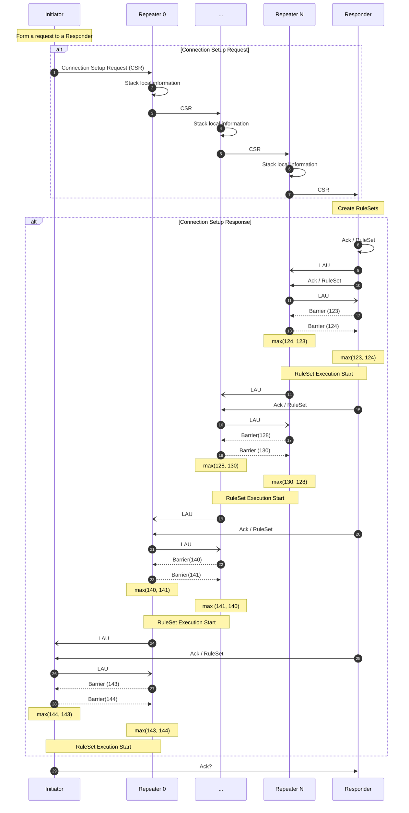
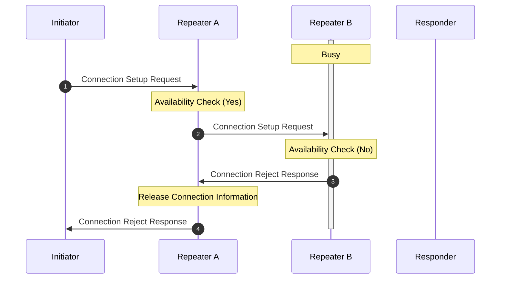

# Connection Setup 

## Abstract

## Introduction

In the context of quantum networking and internet, connection setup refers to the process of establishing a connection between two or more end nodes in a quantum network. This task is crucial because it allows for the transfer of quantum information and enables various quantum communication protocols.

To ensure reliable and efficient quantum communication, network nodes need to manage and allocate the available entanglement resources effectively especially for near-term quantum network that is extremely fragile to the noise and loss. 

## Terminology and Notation
The following words are defined as follows.

**Bell pair**

A two qubit maximally entangled state that can be used to send quantum information.

**End node**

A quantum network node that has one interface to make entanglment. An end node may have stationary quantum memory that is capable of storing quantum state or may only have a measurement device to read out quantum information.

**Entanglement**

Multiple qubits (mainly two qubits in this document) state are entangled means that there are correlations between those qubits and those correlated qubits does not change their state independently.

**Entanglement Swapping**

Entanglement swapping is a technique that teleports entanglement and get a longer entangled state by consuming two relatively shorter entangled states. 

**Fidelity**

Fidelity is a metric that represents how close the quantum state is to the ideal state. The fidelity can be 0 to 1 and the state is exactly ideal when the fidelity is 1.

**Initiator**

The *initiator* is an end node quantum computer that demands quantum network and internet services.

**Repeater**
**Responder**
**Router**

## Routing
Before establishing the connection between two end nodes, the network nodes properly identify which path(s) is good enough to support the application. The routing is out of scope of the connection setup, however, it is necessary to determine the route from the initiator to the responder with several properties such as the entanglement generation time, entanglement fidelity into consideration.

## Two-Pass Connection Setup
The connection setup starts at the *Initiator* and the initiator forms a *Connection Setup Request*. This connection setup request go through the intermediate quantum repeaters and eventually reaches the *Responder* which is the other end node which may provide quantum network application services.
The terms *initiator* and the *responder* are used in similar way as the *client* and the *server* in the classical netowrking.

## Connection Setup Sequence
The connection setup is performed as the following sequence.

### Contents of Connection Setup Request
:warning: (Under construction)
Initiator needs to form a request that contains a set of criteria for resources to be consumed in the application.

These are the set of properties that are the requirements for the application.

- Entanglement Generation Rate
The gentanglement eneration rate is quite important for users to accomplish the application. 

- The threshold fidelity of link entanglement
Is this suppose to be checked before routing?
The fidelity is also a key factor for the realiable application. 

- The number of end to end entanglement
Quantum Application Client should know about how many Bell pairs (or other entangled states) do the initiator need to get the application done. 

### Connection Setup Reject
>⚠️ What's the rejection policy -> depends on mux scheme?
> The possibility of rejection should be eliminated in the routing process?

If one of the intermediate repeaters is not capable of supporting the requested connection, the intermediate repeater must notify the `Initiator` that the connection cannot be established at that time. That response is notified to the initiator and the initiator should have choices to wait for some amount of time and restart the connection setup or completely discard the connection setup information and notify application failure to users.

In the case where the intermediate repeater `Repeater B` reject the connection setup request from the Initiator.

In this example, Responder B is busy for other connection and it is hard to provide enough number of resources to the new connection. This rejection policy depends on the resource allocation and multiplexing policy of the link.

When the `Repeater B` receives the Connection Setup Request, `Repeater B` checks if there is available resource to this connection. If there is available resource to the connection, forward the request with the node information. Otherwise, `Repeater B` sends back `Connection Setup Reject` to `Repeater A` and this `Connection Setup Reject` is forwarded to the initiator.

> Does this contain information such as estimated availble time or etc?
### Connection Setup Response

### Link Allocation Update (LAU)
When a new connection is added or eliminated from the network, the resource allocation way might be changed. For example, in the case the two connections are competing one single link, the resource might be evenly distributed or distributed based on some algorithms. After one of two connection is done its entanglement genration, all the resource go into the remaining connection. During this transition, the link must properly know the allocation rule is changed and must be shared with neighboring node to keeep the consistency of the resource allocation. The worst case is that allocating one side of the resource to one connection and allocating the other side of the resurce to another connection.

### Barrier
> from rdv's reply in slack

Barrier specifies the time at which the link switches from the current LA to the negotiated LA. It must come after the negotiation for the new LA is complete. For MSM links, as shown in the diagram, the Barrier value is the Photon Pair Trial Sequence Number for the link. The PPTSN is defined by the EPPS. For MIM links, the PPTSN is defined by the BSA. For MM links, for consistency, it should be defined by the receiving end.

## Reference
[^VAN2013]: Van Meter, Rodney, et al. "Path selection for quantum repeater networks." Networking Science 3 (2013): 82-95.