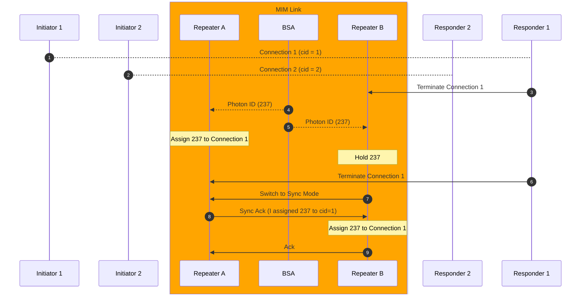
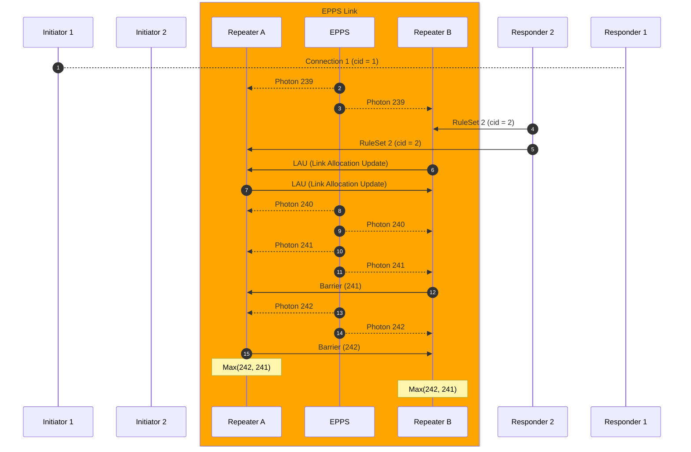

# Connection Teardown

## Connection Teardown

## Protocol Sequence (Edge case?)
An example sequence of the entire protocol

:warning: (Under construction)
- How and when do we notify it to the application?
- What information to be attached?

New version with barrier
