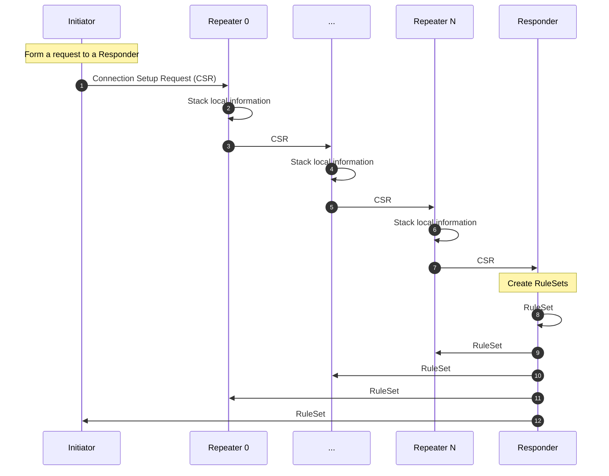
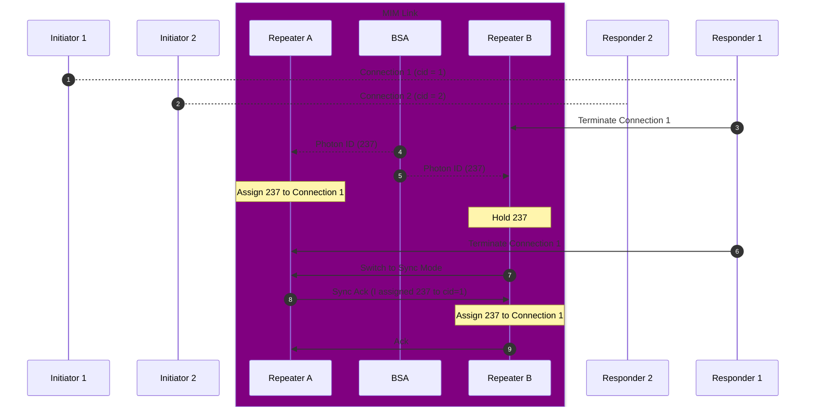

# Connection Setup and Teardown

## Connection Setup
In the connection setup phase, the initiator (an end node quantum computer that sends starts a process) sends a request to a responder (an end node quantum computer that provides a quantum application service) and that responder creates a set of RuleSet and distributes them to the intermediate quantum repeaters and routers.

## Protocol Sequence

### Contents of Connection Setup Request
:warning: (Under construction)
- Bell pair per sec?
- Fidelity of Bell pairs?
- Link cost requirements?

## Connection Teardown

## Protocol Sequence
An example sequence of the entire protocol

:warning: (Under construction)
- How and when do we notify it to the application?
- What information to be attached?
