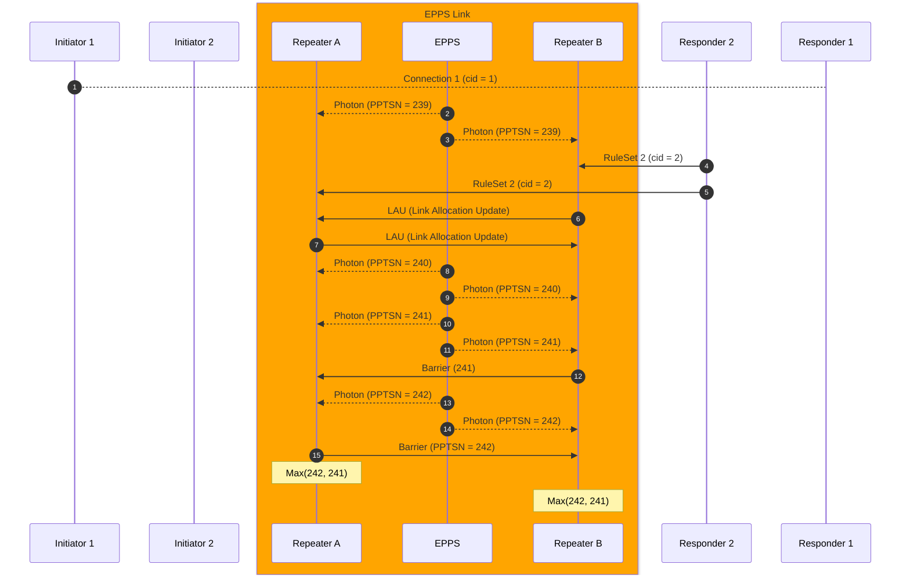
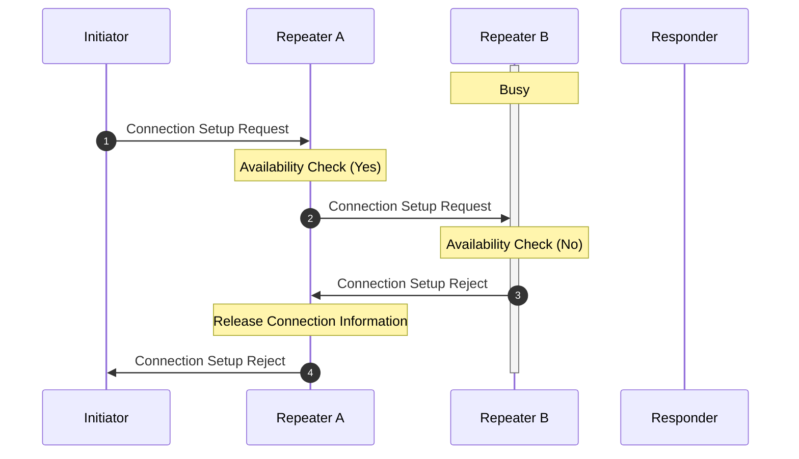
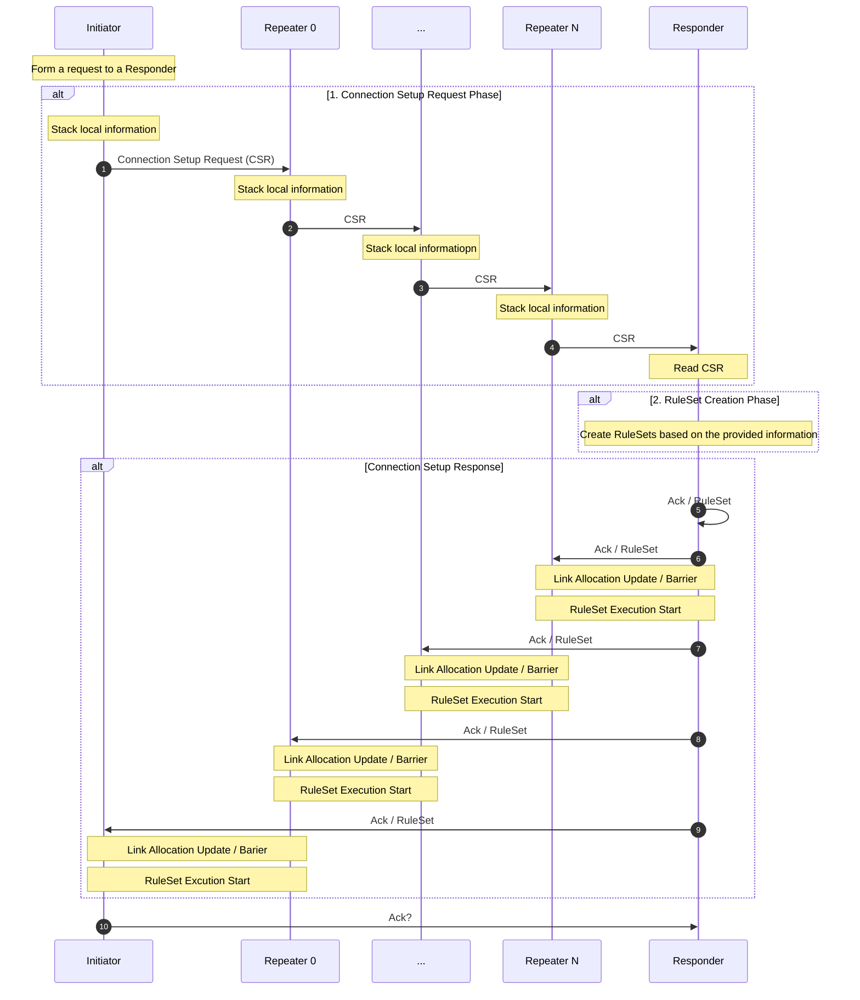
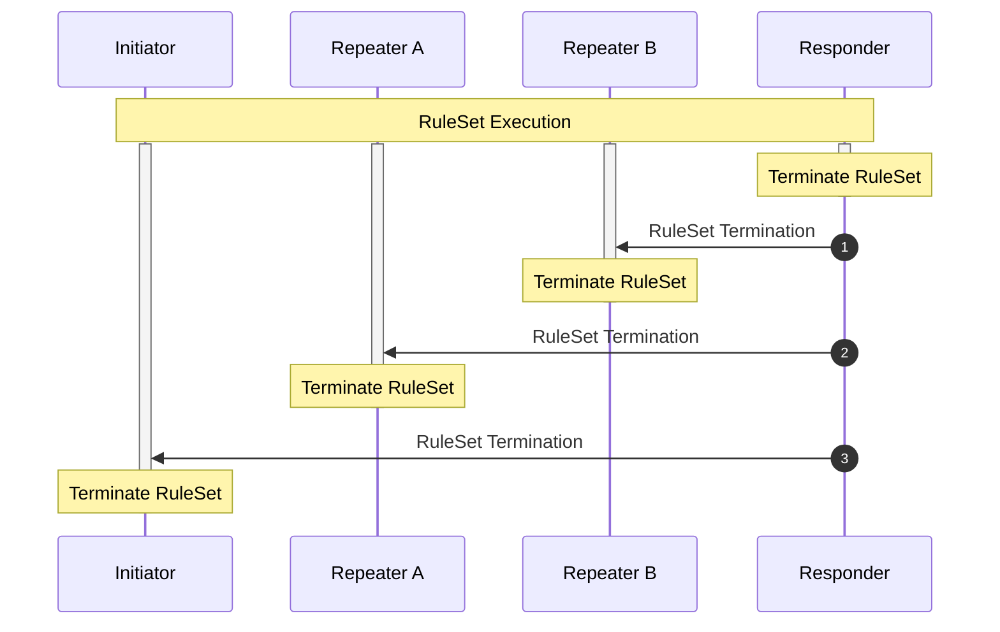
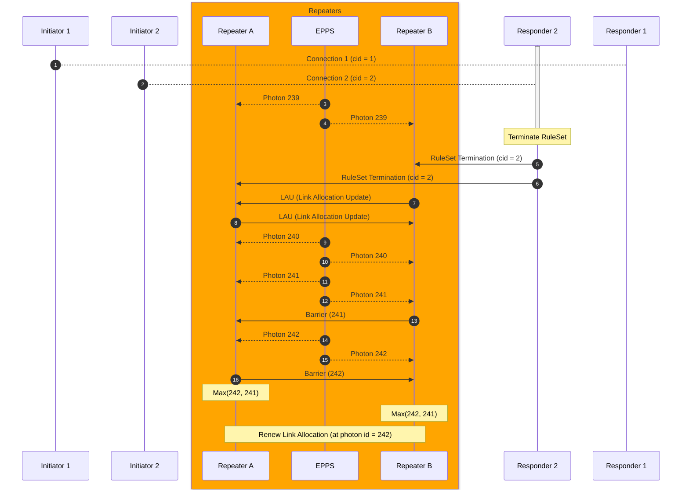

# Draft: Connection Setup and Teardown

> Authors: Ryosuke Satoh, Rodney Van Meter, Takaaki Matsuo (previous draft)
> This is an updated version of [connection setup draft](https://datatracker.ietf.org/doc/html/draft-van-meter-qirg-quantum-connection-setup-01)

- [Draft: Connection Setup and Teardown](#draft-connection-setup-and-teardown)
  - [Abstract](#abstract)
  - [1. Introduction](#1-introduction)
  - [2. Terminology](#2-terminology)
  - [3. Preliminaries](#3-preliminaries)
    - [3.1 Quantum Recursive Network Architecture](#31-quantum-recursive-network-architecture)
    - [3.2 Quantum Repeater Software Architecture (QRSA)](#32-quantum-repeater-software-architecture-qrsa)
    - [3.3 Routing](#33-routing)
    - [3.4 Network Resource and Resource Allocation](#34-network-resource-and-resource-allocation)
  - [4. Connection Setup](#4-connection-setup)
    - [4.1 Connection Setup Phases](#41-connection-setup-phases)
    - [4.2 Connection Setup Request and Performance Indicators](#42-connection-setup-request-and-performance-indicators)
    - [4.3 RuleSet](#43-ruleset)
    - [4.4 Connection Setup Response](#44-connection-setup-response)
    - [4.5 Link Allocation Update](#45-link-allocation-update)
    - [4.6 Barrier](#46-barrier)
    - [4.7 Connection Setup Rejection](#47-connection-setup-rejection)
    - [4.8 Null Connection Setup Request and Response](#48-null-connection-setup-request-and-response)
    - [4.9 Connection Setup Example in single network](#49-connection-setup-example-in-single-network)
  - [5. Connection Teardown](#5-connection-teardown)
    - [5.1 Connection Teardown Phases](#51-connection-teardown-phases)
    - [5.2 RuleSet Termination](#52-ruleset-termination)
    - [5.3 Teardown Link Allocation Update](#53-teardown-link-allocation-update)
    - [5.4 Free Terminated Resources](#54-free-terminated-resources)
    - [5.5 Unexpected RuleSet Termination](#55-unexpected-ruleset-termination)
  - [6. Message Contents and Elements](#6-message-contents-and-elements)
    - [6.0 Header and meta information](#60-header-and-meta-information)
    - [6.1 Connection Setup Request](#61-connection-setup-request)
    - [6.2 Performance Indicator](#62-performance-indicator)
    - [6.3 Connection Setup Reject](#63-connection-setup-reject)
    - [6.4 Connection Setup Response](#64-connection-setup-response)
    - [6.5 Connection Teardown Request](#65-connection-teardown-request)
    - [6.6 RuleSet](#66-ruleset)
    - [6.7 Link Allocation Update (LAU)](#67-link-allocation-update-lau)
    - [6.8 Barrier](#68-barrier)
    - [6.9 Null Setup Request](#69-null-setup-request)
    - [6.10 RuleSet Execution Abort](#610-ruleset-execution-abort)
  - [7. Service Configuration](#7-service-configuration)
    - [7.1 Primary TCP port number for connection setup request](#71-primary-tcp-port-number-for-connection-setup-request)
  - [Considerations](#considerations)
  - [References](#references)


## Abstract
The initial step to peform quantum application across multiple quantum computers in quantum network is to establish a connection beteween two or more participant end nodes. The process of establishing a connection in a quantum network often necessitates additional information compared to a classical network, particularly in the case of near-term quantum networking. This is primarily due to the inherent fragility of quantum systems, which are sensitive to noise and losses.

This documents specifies how to establish a connection between two end nodes with RuleSet which is a flexible representation of instruction for quantum repeaters. 

## 1. Introduction
<!-- Done -->
<!-- Introduction for Connection Setup-->
Quantum Communication aims to exchange quantum information over distant quantum computers to perform large-scale quantum computation, secret sharing, and various kinds of quantum applications. Establishing a connection across a quantum network [^KIM2008] is the first fundamental classical task for running a quantum network application. However, due to the photon loss and fragility of the quantum information, quantum communication between two (or more) end nodes requires coordinated computation among the set of quantum repeaters on the path, rather than the current store-and-forward network session [^VAN2014].

<!-- Introduction to RuleSet -->
The various properties of the repeater and quantum link must be properly taken into account when creating instructions for quantum repeaters. RuleSet is a flexible representation for instructing quantum repeaters based on the noise, loss and other properties they provide.

<!-- Things to be explained -->
In this document, we discuss the properties to be provided for creating RuleSet and how that information is accumulated in the connection setup process. Additionally, we discuss how the RuleSets are created and distributed to quantum repeaters.

<!-- Note -->
The discussion in this document is limited to the two-party connection setup process. Multipartite connection setup is left for further discussion.


## 2. Terminology
<!-- Done -->
The following terms will be used (Lexical order):

**Bell pair**

A two qubit maximally entangled state that can be used to send quantum information. 

**Bell State Analyzer (BSA)**

A device that performs Bell State Measurement.

**End node**

A quantum network node that has one interface to make entanglment. An end node may have stationary quantum memory that is capable of storing quantum state or may only have a measurement device to read out quantum information.

**Entanglement**

Multiple qubits (mainly two qubits in this document) state are entangled means that there are correlations between those qubits and those correlated qubits does not change their state independently.

**Entanglement Swapping**

Entanglement swapping is a technique that teleports entanglement and get a longer entangled state by consuming two relatively shorter entangled states.

**Entanglement Photon Pair Source (EPPS)**

A device that continuously generate entangled photon pairs. 

**Fidelity**

Fidelity is a metric that represents how close the quantum state is to the ideal state. The fidelity can be 0 to 1 and the state is exactly ideal when the fidelity is 1.

**Initiator**

Initiator is an end node quantum computer that demands quantum network and internet services.

**Repeater**

Quantum Repeater is a device that has two outbound QNIC interfaces.

**Responder**

Responder is an end node quantum computer that provides quantum network application services.

**Router**

Quantum Router is a device that has more than two outbound QNIC interfaces that could switch the route from Initiator to Responder.

**Quantum Network Interface Card (QNIC)**

QNIC is a deivce that stores a set of communication qubits and controllers of them.

**Qubit**

Qubit is a unit of information and sometimes refers to physical devices that stores one bit of quantum data. Qubit is also used as a carrier of quantum information.

**Quantum Node**

Quantum Node represents either quantum repeater, quantum router or end ndoes.

## 3. Preliminaries
### 3.1 Quantum Recursive Network Architecture
<!-- Done -->
`Quantum Recursive Network Architecture (QRNA)` [^VAN2011] is a network architecture for quantum networks that draws inspiration from the `Recursive Network Architecture (RNA)` [^TOU2008]. RNA introduces the concept of meta protocol that allows us to implement network protocols in different layers by unified functions.
Throughout this document, the underlying network architecture assumption is based on QRNA.

### 3.2 Quantum Repeater Software Architecture (QRSA)

### 3.3 Routing
<!-- Done -->
Prior to establishing a connection across the network, suitable path(s) from Initiator to Responder must be detected. While the specific routing process falls outside the scope of connection setup, it remains essential to determine the optimal route from the Initiator to the Responder, considering various properties such as entanglement generation time and entanglement fidelity [^VAN2013].

### 3.4 Network Resource and Resource Allocation
<!-- Done -->
In quantum communication, one of the fundamental network resources is the Bell state, which is a bipertite entangled state. Throughout this document, unless otherwise specified, the term "resource" refers specifically to a Bell pair.

The generation of this resource occurs at the link level, the entanglement between neighboring nodes. The allocation of resources to existing connections may vary depending on factors such as multiplexing policies [^APA2011] and application workloads [^CIC2022]. However, it is crucial that repeaters on both ends of the link assign a certais resource to the same connection.

This document assumes the existence of a resource allocation method in each link and focuses primarily on ensuring the consistency of resource allocation. It delves into strategies for maintaining the coherent distribution of resources, while assuming the availability of a predefined allocation approach.


## 4. Connection Setup

### 4.1 Connection Setup Phases
<!-- Overview of connection setup -->
<!-- Done -->
The single-network, two-node connection setup procedure consists of three phases:

1. `Connection Setup Request Phase`: The outbound request is routed from Initiator to Responder using a standard NextHop-based forwarding table, accumulating information about the path along the way in a stack of Performance Indicators.

2. `RuleSet Creation Phase`: When the request arrives at the Responder, the Responder uses that information to create a complete RuleSet for every node. The RuleSets are assembled into a stack with the nearest node at the top.

3. `Connection Setup Response Phase`: The RuleSets are sent back along the original path, with each node removing its RuleSet from the message (popping the stack), then forwarding the remaining QCaps on until it returns to the Initiator.

The multi-network, two-node connection setup procedure contains one additional step.

4. `RuleSet Rewrite Phase`: When a RuleSet arrives at the interface node in different network, that node is responsible for rewriting RuleSet for quantum repeaters in subnet. In other words, the higher layer node that receives RuleSet creates RuleSets for lower layer nodes.

This document mainly focus on step 1 to step 3, connection setup in one local quantum netowork.

### 4.2 Connection Setup Request and Performance Indicators
<!-- Requesting Connection and stacking performance properties of memory and link -->
<!-- Done -->
The first step of connection setup is issuing `Connection Setup Request` in Initiator. This request contains a comprehensive set of information regarding application and its performance requirements. Additionally, the request packet includes the routed path information from Initiator to Responder.

After creating connection setup request packet, it is transmitted to the next hop quantum repeater. This quantum repeater provides `Performance Indicators` such as the fidelity of link-level Bell pair between previous hop quantum node (The Initiator in this case) and generation rate of it. Furthermore, it offers hardware calibration result which indicates the performance of gate operation, measurement operation, memory lifetime and other relevant factors. 

The request packet traverses the entire path, collecting performance indicators from each quantum repeater it encounters, until it finally reaches the Responder.


### 4.3 RuleSet
<!-- Creating RuleSet based on provided information -->
<!-- Todo -->
*RuleSet* [^MAT2019] is a collection of instructions for intermediate quantum repeaters and routers. It consists of a set of *Rules*, each comprising a *Condition* and an *Action*. RuleSet works similary to match-action style protocols such as OpenFlow [^MCK2008]. A rule could have one or multiple condition clauses about the status of resources, messages as a Codition. Once all the condition clauses are satisfied, the corresponding action clauses in an Action are performed. Some possible condition clauses and action clauses are outlined in a architectual proposal by Van Meter et al. [^VAN2022]. 

One RuleSet is created for one quantum repeater/router or end nodes (Initiator/Responder) so that the number of RuleSets is the same as the number of quantum nodes in the path.

In order to gurantee the consistency between RuleSets, Responder creates all the RuleSets along the quantum nodes in the path.

### 4.4 Connection Setup Response
<!-- Wrap up RuleSet and distribute -->
<!-- Done  -->
After Responder receives `Connection Setup Request` and creates RuleSets for all the nodes in the path, Responder wrap up these RuleSets and send `Connection Setup Response` through the path back to Initiator. Intermediate repeaters pop out their RuleSet and forward remaining RuleSet to the next repeaters.

Once repeaters receive the RuleSet, they start resource allocation policy negotiation explained in 4.5 and 4.6. 

### 4.5 Link Allocation Update
<!-- Started new connection and start allocating resources to the new connection -->
<!-- Done -->

When a new application is up and running or when a running application is terminated and closed, the resource allocation must be updated. For instance, when two connections contend for the utilization of a single link, the resources can be distributed evenly or according to a specific algorithm. Once one of the connections completes its entanglement generation, all resources in the next generation round are assigned to the remaining connection. During this transition, it is essential for the link to accurately identify the change in the allocation rule and communicate this change to the neighboring node to ensure consistent resource allocation.

If this link allocation (LA) transition is handled improperly, communications can be disrupted for all connections sharing the link. The scenario to be avoided is inconsistent allocation of resources at the two ends of the link.
A problem occurs if one link end allocates its share of the resource to one connection while the other end of the link allocates its share of the resource to another connection. In this case, the two RuleSets operating at the two link ends will have inconsistent views of the set of available resources, and will make inconsistent decisions that result in failure to create the E2E resources properly. In the worst case, all connections passing through the link can fail: if one end allocates resources to connections A, B and C in the sequence ABABABCABCAB as connection C starts, but the other end allocates in the sequence ABABAABCABCA, then all subsequently generated resources will be allocated improperly and all three connections will fail. Recovery from this failure will be difficult.

Updating the link allocation policy involves the following steps:
1. Creation of Link Allocation Policy: Repeaters and routers generate a new link allocation policy by considering the requested or removed `Connection IDs`. They collect the current active `Connection IDs` and add or remove the target connection from the list. The repeaters and routers create a new set of `Connection IDs` with an assigned order.

2. Incorporating Random Number into LAU: Repeaters and routers create a `Link Allocation Update (LAU)` message that includes the new set of `Connection IDs` along with a randomly generated number. This random number is also stored locally for use in subsequent steps.

3. LAU Exchange and Random Number Comparison: Repeaters and routers on both sides of the link exchange the LAU messages and verify if the list of `Connection IDs` matches what was sent to the counterpart.
If the list of `Connection IDs` matches, repeaters compare the random number given by counterpart repeater and if the counterpart's random number is larger than its random number, use the counterpart's 

Note that the algorithms for resource allocation must be shared or configured before LAU happens.
For example, both repeaters in one linke agree on the round robin style resource allocation and this allocation method itself 
### 4.6 Barrier
<!-- Barrier to align LAU activation -->
<!-- Todo -->

Barrier specifies the time at which the link switches from the current Link Allocation (LA) to the negotiated LA. It must come after the negotiation for the new LA is complete. For MSM links, as shown in the previous diagram, the Barrier value is the `Photon Pair Trial Sequence Number (PPTSN)` for the link. The PPTSN is defined by the EPPS. For MIM links, the PPTSN is defined by the BSA. For MM links, for consistency, it should be defined by the receiving end.

The following diagram shows detailed LAU and Barrier processes.

`Link Allocation Update (LAU)` contains a set of information to make a new policy for link resource allocation. This policy must be agreed on both sides of the link.

After both repeater agree on a new policy, they have to descide when they activate a new policy. `Barrier` message tells the counterpart repeater the earliest index of resource. In the example above, Repeater B tells resource 241 is the next available resource for a new connection. However, Repeater A tells resource 242 is the next available resource. To properly align the assigning resource beteween Repeater A and B, they take `Max` of the given resource indices and choose when they switch from old link allocation policy to a new link allocation policy.


### 4.7 Connection Setup Rejection
<!-- Done -->
In certain scenarios, it is possible that one of the intermediate repeaters or routers may be unable to accommodate an additional connection due to various reasons, such as system failures or being occupied by other existing connections. In that case, intermediate repeaters send back `Connection Setup Reject` message to Initiator. 



In this example, Responder B is busy for other connections and it is difficult to meet requirements of the application. This rejection policy depends on the resource allocation and multiplexing policy of the link.

Upon receiving `Connection Setup Request`, the repeater checks the availability of resources for the requested connection. If sufficient resource are available, forward `Connection Setup Request` to the next repeater (`Repeater A` to `Repeater B`). However, if there is insufficient resources (`Repeater B`) it sends `Connection Setup Reject` back to `Repeater A` and `Repeater A` forwards `Connection Setup Reject` to Initiator.

### 4.8 Null Connection Setup Request and Response
<!-- Todo -->
`Null Connection Setup Request (NCSR)` is used to test the E2E connection setup process, but no resource reservation is made.  Link information is collected as request goes from Initiator to Responder. A normal `Connection ID` is created by the Initiator, but the request is for rate zero and fidelity >= 0. The Responder replies with Null RuleSets sent to each node in the path.  All nodes log the request, but do not change Link Allocation or other resource allocation, and do not set up a connection.

### 4.9 Connection Setup Example in single network
<!-- Done -->
The following diagram shows a full example of connection setup.
<details open>
<summary> Sequence diagram </summary>



</details>

Initiator creates `Connection Setup Request (CSR)` message which contains information of application that Initiator wants to perform. Initiator also provides criteria for the available resource and time consumptions. Initiator sends this request to the neighbor quantum repeater with interface and link information.

Intermediate quantum repeaters provide their informaiton and relay the Connection Setup Request to the Responder. Eventually, CSR is unpacked in the Responder and the information that intermediate repeaters provide is extracted.

Responder uses the extracted information to create RuleSets which contains a set of instructions for end nodes (Initiator/Responder) and intermediate quantum repeaters. Responder distributes generated RuleSets as `Connection Setup Response` which acknowlege the CSR. When end nodes and intermediate repeaters receive RuleSet, they start negotiation process to choose how to assign remaining resources and when to start the process. This process is done by `Link Allocation Update` message and `Barrier` message.

## 5. Connection Teardown
### 5.1 Connection Teardown Phases
<!-- Todo -->
Connection teardown consists of the following three phases.
- `RuleSet Termination Phase`: Termination of the RuleSet at the end node occurs when the RuleSet execution is completed. Once terminated, the end node sends a `RuleSet Termination message` to the intermediate quantum repeaters.

- `Link Allocation Update Phase`: Upon receiving `RuleSet Termination` message, repeaters start negotiating next link allocation policy with counterpart quantum repeater. They exchange `Link Allocation Update` message and decide the next link allocation.
- `Free Terminated Resource Phase`: Free unused but no longer used resources.

### 5.2 RuleSet Termination
<!-- Done -->
Once the Initiator and Responder have completed their application, the established connection needs to be terminated to allow other connections to utilize the resources. Both the Initiator and Responder's RuleSets include a specific rule referred to as the "Terminate RuleSet." This rule triggers the execution completion of the RuleSet in the end nodes and prompts the transmission of "RuleSet Termination" messages to the intermediate repeaters.



When other nodes (`Repeater A`, `Repeater B` and `Initiator`) receive `RuleSet Termination` message, they start `Link Allocation Update` process and stop running RuleSet.

### 5.3 Teardown Link Allocation Update
<!-- Link Allocation Update (Connection Teardown ver.) -->
<!-- Done -->
Similar to the connection setup process, the link allocation policy needs to be updated when a connection is terminated. 

When a repeater receives `RuleSet Termination`, it sends `Link Allocation Update (LAU)` message to both neighbors and start negotiating link allocation policy.

The follwoing diagram shows an example of connection teardown (Close up connection teardown between Repeater A and Repeater B).



The following numbers are corresonding to the numbers in the diagram.

(1, 2): There are two connections, namely `Initiator 1` - `Responder 1` and `Initiator 2` - `Responder 2`, which share a single link between `Repeater A` and `Repeater B`. The EPPS continuously generates entangled photon pairs and distributes them to `Repeater A` and `Repeater B`.

(3-4, 9-10, 11-12, 14-15): The photon pairs are labeled with sequential IDs.

(5, 6): The active RuleSet is terminated at `Responder 2`, and a RuleSet Termination message is sent to both `Repeater B` and `Repeater A`. In this scenario, since `Repeater B` is closer to `Responder 2` than `Repeater A`, it receives the message before `Repeater A` receives.

(7, 8): Immediately after receiving the `RuleSet Termination` message, the repeaters commence negotiations for the next link allocation policy. To exchange information about the ongoing connection, they exchange LAU messages and formulate a new link allocation policy.

(13, 16): Once the repeaters agree on a new link allocation policy, they must also agree on the point at which they transition to the negotiated link allocation policy. They exchange a `Barrier` message containing the next photon pair ID and utilize a photon with a larger index.


### 5.4 Free Terminated Resources
After being switched Link Allocation, repeaters frees unconsumed resources including multi-hop remote entanglement that belong to the old connection.


### 5.5 Unexpected RuleSet Termination
<!-- Todo -->
During the RuleSet execution, quantum operation might be accidentally stopped by system failure or user interruption. As soon as one of the repeater in the path detects unexpected termination in the neighbor nodes, it sends `RuleSet Execution Abort` message to Responder and Responder terminate corresponding connection.

## 6. Message Contents and Elements

### 6.0 Header and meta information
Every message has the following header and meta information. 

```json
{
  "title": "Meta",
  "description": "Meta information",
  "type": "object",
  "required": [
    "src",
    "dst"
  ],
  "properties": {
    "src": {
      "description": "Identifier for the source node",
      "type": "string"
    },
    "dst": {
      "description": "Identifier for the destination node",
      "type": "string"
    }
  }
}
```

### 6.1 Connection Setup Request
<!-- Done -->
`Connection Setup Request` has to convey what is the application to run on the

- `Path Information`: Address or labels for Initiator/Responder and Intermediate Repeaters that identify the path from Initiator to Responder.

- `Performance requirements`: A minimum requirements for the link-level entanglement generation performance such as fidelity of generated Bell pairs and throughput.

<details open>
<summary> Connection Setup Request Schema</summary>

```json
{
  "title": "Connection Setup Request",
  "description": "A message to request to establish a connection between Responder",
  "type": "object",
  "required": [
    "pathInformation",
    "performanceRequirements"
  ],
  "properties": {
    "pathInformation": {
      "type": "array",
      "description": "Node labels of intermediate repeaters in routed path",
      "items": {
        "type": "string"
      }
    },
    "performanceRequirements": {
      "type": "object",
      "properties": {
        "fidelity_threshold": {
          "type": "number"
        },
        "generation_rate": {
          "type": "number"
        }
      }
    }
  }
}

```

</details>

### 6.2 Performance Indicator
<!-- Done -->
- `Raw Entanglement Generation Rate`: Entanglement generation rate of the link between the node in Initiator side. This rate is calculated as the number of physical entanglement generated in the link over a unit time. 
  
- `Calibration Result`:  A set of calibration results that could be used for estimating fidelity after certain number of purification, error correction. 
> We might not need that level of details

<details open>
<summary> Performance Indicator Schema</summary>

```json
{
  "title": "Performance Indicator",
  "description": "Indicators of link and node performance",
  "type": "object",
  "required": ["rawEntanglementGenerationRate", "calibrationResult"],
  "properties": {
    "rawEntanglementGenerationRate": {
      "description": "Link-level entanglement generation rate between Initiator side node",
      "type": "number"
    },
    "calibrationResult": {
      "type": "object",
      "properties": {
        "rawEntanglementFidelity": {
          "type": "number"
        },
        "calibrationResult": {
          "description": "Required informaiton for estimating fidelity after purification and QEC",
          "type": "object"
        }
      }
    }
  }
}
```
</details>

### 6.3 Connection Setup Reject
<!-- Todo -->
In order to notify the requested connection is rejected by some reason in some node, `Connection Setup Reject` contains the following information.

- `Rejected Host`: Initiator would like to know where in the path the request is rejected.

- `Reason Code`: The `Reason Code` represents the reason why the connection is rejected. This information would be used for deciding the next action in Initiator.

- `Estimated Next Available`: If the repeater can estimate when the link is available, this information is useful to decide what is the next action for Initiator. 


<details open>
<summary> Connection Setup Reject Schema</summary>

```json
{
  "title": "Connection Setup Reject",
  "description": "Rejection of Connection Setup in the intermediate node or end node",
  "type": "object",
  "required": ["rejectedHost", "reasonCode"],
  "properties": {
    "rejectedHost": {
      "type": "string"
    },
    "reasonCode": {
      {"enum": [
        "BUSY",
        "ERROR",
        "UNKNOWN"]}
    },
    "estimatedNextAvailable": {
      "type": "number"
    }
  }
}
```

</details>

### 6.4 Connection Setup Response
<!-- Todo -->
To respond the request from Initiator, Responder sends back `Connection Setup Response` through the path with delivering RuleSet. This `Connection Setup Response` contains the following information.

- `Path Information`: As well as the `Connection Setup Request`, `Connection Setup Response` contains the path information to identify the intermediate quantum repeaters.

- `RuleSet`: A collection of instructions for quantum repeaters.

<details>
<summary> Connection Setup Response Schema </summary>

```json
{
  "title": "Connection Setup Response",
  "description": "Response of Connection Setup Request containing RuleSet",
  "type": "object",
  "required": ["pathInformation", "rulesets"],
  "properties": {
    "pathInformation": {
      "type": "array",
      "item": {
        "type": "string"
      }
    },
    "rulesets": {
      "type": "array",
      "item": {
        "description": "RuleSet goes here",
        "type": "object"
      }
    }
  }
}
```

</details>

### 6.5 Connection Teardown Request
<!-- Done -->
`Connection Teardown Request` contains the `Connection ID` of the tearing down connection.

- `Terminating Connection Id`: `Connection ID` of the terminating connection.

<details>
<summary> Connection Teardown Request</summary>

```json
{
  "title": "Connection Teardown Request",
  "description": "Request for tearing down established connection",
  "type": "object",
  "required": ["terminatingConnectionId"],
  "properties": {
    "terminatingConnectionId": {
      "type": "string",
    }
  }
}
```

</summary>
</details>


### 6.6 RuleSet
<!-- Todo (Maybe in the different spec?)-->
A RuleSet contains a set of rules that tells quantum network nodes what to do. One RuleSet is composed of metadata and a set of stages that contains a set of rules.
> Details in a different specification


### 6.7 Link Allocation Update (LAU)
<!-- Done -->
LAU contains the following information.
- `Active Link Allocation`: To check what connections are running on the link, share the set of running `Connection IDs`.

- `Next Link Allocation`: Offer a new link allocation policy to counterpart quantum repeater. This Link Allocation contains a new set of `Connection IDs` and resources are allocated from the first connection in the list.

- `Random Number`: When the order of `Next Link Allocaiton` is different from counterpart's `Next Link Allocation`, they have to choose which `Next Link Allocation` is used. To solve this problem, repeater generates a random number and the one whose number is larger is used as `Next Link Allocation`. 

```json
{
  "title": "Link Allocation Update",
  "description": "Negotiation for link allocatin policy",
  "type": "object",
  "required": [
    "activeLA",
    "nextLA",
    "randNumber"
  ],
  "properties": {
    "activeLA": {
      "type": "array",
      "description": "Current set of connection IDs",
      "items": {
        "type": "string",
        "description": "Connection ID"
      }
    },
    "nextLA":{
      "type": "array",
      "description": "Next set of connection IDs. The order is matter.",
      "items": {
        "type": "string",
        "description": "Connection ID"
      }
    },
    "randNumber": {
      "type": "number",
      "description": "Random Number to decide primary LA"
    }
  }
}
```

### 6.8 Barrier
<!-- Todo -->
In order to align the timing for switching from old LA to a new LA, `Barrier` message contains the following information.

- `Photon Pair Trial Sequence Number (PPTSN)`: An identifier for the link-level entanglement given by EPPS in MSM link and BSA node in MIM or MM link.

```json
{
  "title": "Barrier",
  "description": "Sync Link Allocation switching timing",
  "type": "object",
  "required": [
    "photonPairTrialSequenceNumber"
  ],
  "properties": {
    "photonPairTrialSequenceNumber": {
      "type": "number",
      "description": "Incremental trial id for link Bell pair for switch timing alignment."
    }
  }
}

```

### 6.9 Null Setup Request
<!-- Todo -->

`Null Setup Request` is used to confirm the connection from Initiator and Responder, but there is no operations acutually executed. The contents are almost the same as the ordinary `Connection Setup Request` but each element has default value and no actual resource allocation happens.

```json
{
  "title": "Null Setup Request",
  "description": "A null request for connectivity test",
  "type": "object",
  "required": [
    "pathInformation",
    "performanceRequirements",
  ],
  "properties": {
    "pathInformation": {
      "type": "array",
      "description": "Node labels of intermediate repeaters in routed path",
      "minItems": 0,
      "items": {
        "type": "string"
      }
    },
    "performanceRequirements": {
      "type": "object",
      "properties": {
        "fidelity_threshold": {
          "type": "number",
          "default": 0
        },
        "generation_rate": {
          "type": "number",
          "default": 0
        }
      }
    }
  }
}
```

### 6.10 RuleSet Execution Abort
In order to notify the RuleSet execution is accidentally stopped in the intermediate repeaters or end nodes, `RuleSet Execution Abort` message contains the following information.

```json
{
  "title": "RuleSet Execution Abort",
  "description": "Notification for unexpected RuleSet termination",
  "type": "object",
  "required": ["connectionID"],
  "properties": {
    "connectionID": {
      "type": "string"
    }
  }
}
```

## 7. Service Configuration
### 7.1 Primary TCP port number for connection setup request
Responder node is listening Initiator's request at 52244 port.


## Considerations
- Security Aspects
- System failure, error handling
- Follow [rfc 2119](https://datatracker.ietf.org/doc/html/rfc2119)


## References
[^KIM2008]: Kimble, H. Jeff. "The quantum internet." Nature 453.7198 (2008): 1023-1030.
[^MCK2008]: McKeown, Nick, et al. "OpenFlow: enabling innovation in campus networks." ACM SIGCOMM computer communication review 38.2 (2008): 69-74.
[^TOU2008]: Touch, Joseph D., and Venkata K. Pingali. "The RNA metaprotocol." 2008 Proceedings of 17th International Conference on Computer Communications and Networks. IEEE, 2008.
[^APA2011]: Aparicio, Luciano, Rodney Van Meter, and Hiroshi Esaki. "Protocol design for quantum repeater networks." Proceedings of the 7th Asian Internet Engineering Conference. 2011.
[^VAN2011]: Van Meter, Rodney, Joe Touch, and D. Horsman. "Recursive quantum repeater networks." arXiv preprint arXiv:1105.1238 (2011).
[^VAN2013]: Van Meter, Rodney, et al. "Path selection for quantum repeater networks." Networking Science 3 (2013): 82-95.
[^VAN2014]: Van Meter, R., "Quantum Networking", Wiley-iSTE , 2014.
[^WEH2018]: Wehner, Stephanie, David Elkouss, and Ronald Hanson. "Quantum internet: A vision for the road ahead." Science 362.6412 (2018): eaam9288.
[^MAT2019]: Matsuo, Takaaki, Clément Durand, and Rodney Van Meter. "Quantum link bootstrapping using a RuleSet-based communication protocol." Physical Review A 100.5 (2019): 052320.
[^CIC2022]: Cicconetti, Claudio, Marco Conti, and Andrea Passarella. "Resource allocation in quantum networks for distributed quantum computing." 2022 IEEE International Conference on Smart Computing (SMARTCOMP). IEEE, 2022.
[^VAN2022]: Van Meter, Rodney, et al. "A quantum internet architecture." 2022 IEEE International Conference on Quantum Computing and Engineering (QCE). IEEE, 2022.
