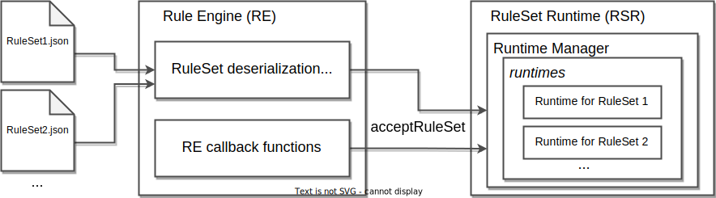

# RuleSet execution
This section introduces how the rulesets are executed in the RuleEngine and related components.
> This specification expect the existance of the RuleSet runtime
- [RuleSet execution](#ruleset-execution)
  - [Overview](#overview)
  - [Components](#components)
    - [RuleEngine](#ruleengine)
    - [RuleSet Runtime](#ruleset-runtime)
  - [Serialization and Deserialization](#serialization-and-deserialization)
  - [Runtime](#runtime)
    - [Stage and Rule Execution](#stage-and-rule-execution)
    - [Lifetime](#lifetime)
      - [Variable Lifetime](#variable-lifetime)
      - [Resource Lifetime](#resource-lifetime)
    - [Resource Management](#resource-management)
      - [Naming](#naming)
      - [Promotion and Freeing](#promotion-and-freeing)
      - [Pauli Correction](#pauli-correction)

## Overview
A RuleSet delivered to the quantum repeater is interpreted into the form that can be executed on the RuleEngine (RE) and RuleSetRuntime (RSR).

## Components
### RuleEngine
### RuleSet Runtime

## Serialization and Deserialization

## Runtime
### Stage and Rule Execution
### Lifetime
#### Variable Lifetime
#### Resource Lifetime
### Resource Management
#### Naming
#### Promotion and Freeing
#### Pauli Correction