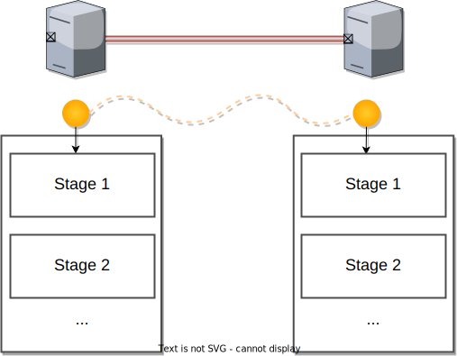

# RuleSet execution
This section introduces how the rulesets are executed in the RuleEngine and related components.
> This specification expect the existance of the RuleSet runtime
- [RuleSet execution](#ruleset-execution)
  - [Overview](#overview)
  - [Components](#components)
    - [RuleEngine](#ruleengine)
      - [Callback functions that RE provides to Runtime](#callback-functions-that-re-provides-to-runtime)
    - [RuleSet Runtime](#ruleset-runtime)
  - [Serialization and Deserialization](#serialization-and-deserialization)
  - [RuleSet Runtime Specification](#ruleset-runtime-specification)
    - [Initialization](#initialization)
    - [Resource Allocation](#resource-allocation)
    - [Stage and Rule Execution](#stage-and-rule-execution)
    - [Resource Management](#resource-management)
      - [Naming](#naming)
      - [Promotion and Freeing](#promotion-and-freeing)
      - [Pauli Correction](#pauli-correction)
    - [Lifetime](#lifetime)
      - [Variable Lifetime](#variable-lifetime)
      - [Resource Lifetime](#resource-lifetime)

## Overview
A RuleSet delivered to the quantum repeater is interpreted into the form that can be executed on the RuleEngine (RE) and RuleSetRuntime (RSR).

## Components

### RuleEngine
RuleEngine (RE) is a software component that is installed as a part of QRSA (Quantum Repeater Software Architecture). RE is responsible for executing RuleSets which are generated by the Responder of the path.
RE works in the following steps.

1. Receive a RuleSet from the Connection Manager
2. Convert a serialized RuleSet into executable RuleSet
3. Initialize a Runtime with that RuleSet and RE callback
4. Assign generated link-level RuleSet to Runtime
5. (When the connection teardown is requested, finish up the RuleSet execution?) ❓

> Explain the initiator and the responder in 2.1
#### Callback functions that RE provides to Runtime
RE provides several functionalities to RuleSet Runtime. Runtime can use these functions to manipulate qubits and to interact with other quantum repeaters and routers.
(:warning: Underconstruction )

**Resource Kind**
- freeQubit: Free the consumed or unused resource's qubits. 
    > called freeAndResetQubit in QuISP
- requestResource: Request more entanglement resources (e.g. for purification)
    > ⚠️ No implementation in QuISP
- requestAncilla: Request ancilla qubits for logical qubits.
    > :warning: No implementation in QuISP
- lockQubit: Get a lock for the qubits
    > Implemented in QuISP but do we need this as callback?
- isQubitLocked: Check if the qubit is locked or not
    > Implemented in QuISP but do we need this as callback?
- isQubitAlive: Check if the qubit does not exceed the expected lifetime
    > ⚠️ cocori: I believe this is required if we need lifetime cutoff

**Quantum Gate Kind**
- gateX: Perform Pauli X gate to a qubit
- gateY: Perform Pauli Y gate to a qubit
- gateZ: Perform Pauli Z gate to a qubit
- gateH: Perform Hadamard gate to a qubit
    > :warning: No implementation in QuISP? I though there was an implementation for this but not in ICallBack
- gateCNOT: Perform CNOT gate to qubits
- gateCZ: Perform CZ gate to qubits

> as extension of these, we could prepare the following functions
- purifyX (YZ): Perform purification for reosources but this can be done the combinations of primitive gates and measurement 

**Measurement Kind**
- measureX: Perform measurement in X basis
- measureY: Perform measurement in Y basis
- measureZ: Perform measurement in Z basis
> Need arbitrary angle measurement?

**Communication Kind**
- sendMessage: Send a message to the proper repeaters, routers and end nodes.
    > Need this for every protocol message?
    > Currently, it's implemented as `sendPurificationResult`, `sendSwappingResult`, etc.
- checkMessage: Check if there is a message queued in the box 
    > ⚠️ No implementation for the current quisp. 
    > I think running RuleSet should be able to check if there is a message from other repeaters to the Rule

### RuleSet Runtime
:warning: Under construction

RuleSet Runtime (RSR) is an entity that is responsible for executing RuleSet. RSR is initiated with the RuleSet given by RE and the instructions in the RuleSet are performed one by one (see the instructions in [2.2.RuleSetSpec](2.2.RuleSetSpec.md))

## Serialization and Deserialization
> may not need this section
RuleSet is distributed in some serialized formats such as JSON. Internally, serialized RuleSet is translated into a class of RuleSet.

## RuleSet Runtime Specification
This section introduces the specifications for RuleSet Runtime.

### Initialization
RuleSet Runtime Manager initializes the RuleSet Runtime with a RuleSet. A runtime is prepared for each RuleSet.

Runtime Manager exposes the following functions to RE.

- `acceptRuleSet`: This function accepts a deserialized RuleSets and RE throw a RuleSet with this function.
- `findRuleSetById`: This function allows RE to find the running RuleSet by its `ruleset_id`.

Once the runtime is created, it's queued up in the waiting list and it waits for being executed.

### Resource Allocation
:warning: Underc construction

RuleSet takes link-level entanglement (entanglement between neighbor quantum repeaters) as a resource. Once a link-level Bell pair is prepared and ready for use, it is allocated to the first stage. 

> :warning: What is the current policy for entanglement pumping?
> Do we keep several qubits for allocating a new entanglement resource in the middle of RuleSet execution?
### Stage and Rule Execution
(:warning: Under construction)

A `Stage` contains a set of Rules and actual execution is done stage by stage.

### Resource Management
#### Naming
#### Promotion and Freeing
#### Pauli Correction

> Do we have condition exclusiveness check?

### Lifetime
#### Variable Lifetime
#### Resource Lifetime
