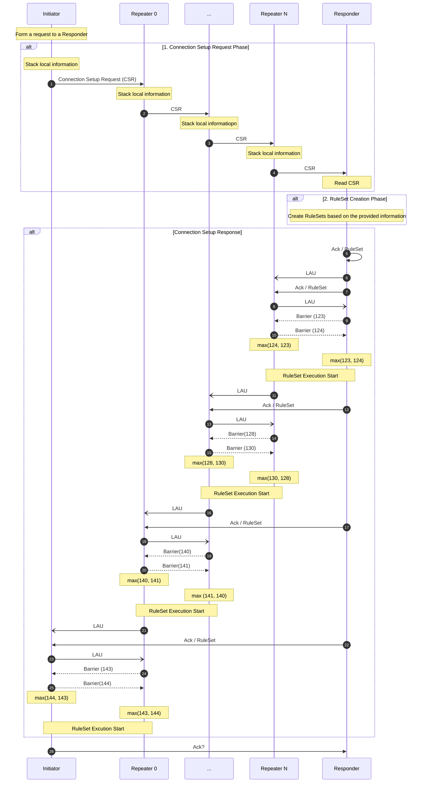

```mermaid
sequenceDiagram
    autonumber
    participant Initiator
    participant Repeater 0
    participant ...
    Participant Repeater N
    participant Responder

    Note over Initiator: Form a request to a Responder

    alt 1. Connection Setup Request Phase
        Note over Initiator: Stack local information
        Initiator ->> Repeater 0: Connection Setup Request (CSR)
        Note over Repeater 0: Stack local information
        Repeater 0 ->> ... : CSR
        Note over ...: Stack local informatiopn
        ... ->> Repeater N: CSR
        Note over Repeater N: Stack local information
        Repeater N ->> Responder: CSR
        Note over Responder: Read CSR
    end

    alt 2. RuleSet Creation Phase
        Note over Responder: Create RuleSets based on the provided information
    end

    alt Connection Setup Response
        # Responder to Repeater N
        Responder ->> Responder: Ack / RuleSet
        Responder -) Repeater N: LAU
        Responder ->> Repeater N: Ack / RuleSet
        Repeater N -) Responder: LAU
        
        # Repeater N and Responder
        Responder -->> Repeater N: Barrier (123)
        Repeater N -->> Responder: Barrier (124)
        Note over Repeater N: max(124, 123)
        Note over Responder: max(123, 124)
        Note over Repeater N, Responder: RuleSet Execution Start

        # Intermediate Repeaters (...) to Repeater N 
        Repeater N -) ... : LAU
        Responder ->> ...: Ack / RuleSet
        ... -) Repeater N : LAU
        Repeater N -->> ... : Barrier(128)
        ... -->> Repeater N: Barrier (130)
        Note over ... : max(128, 130)
        Note over Repeater N : max(130, 128)
        Note over ..., Repeater N: RuleSet Execution Start


        # Repeater 1 to Intermediate Repeaters
        ... -) Repeater 0: LAU        
        Responder ->> Repeater 0: Ack / RuleSet
        Repeater 0 -) ...: LAU
        ... -->> Repeater 0: Barrier(140)
        Repeater 0 -->> ...: Barrier(141)
        Note over Repeater 0: max(140, 141)
        Note over ... : max (141, 140)
        Note over Repeater 0, ...: RuleSet Execution Start

        # Initiator to Repeater 1
        Repeater 0 -) Initiator: LAU
        Responder ->> Initiator: Ack / RuleSet
        Initiator -) Repeater 0: LAU
        Repeater 0 -->> Initiator: Barrier (143)
        Initiator -->> Repeater 0: Barrier(144)
        Note over Initiator: max(144, 143)
        Note over Repeater 0: max(143, 144)
        Note over Initiator, Repeater 0: RuleSet Excution Start

    end

    Initiator ->> Responder: Ack?
```

port 52244