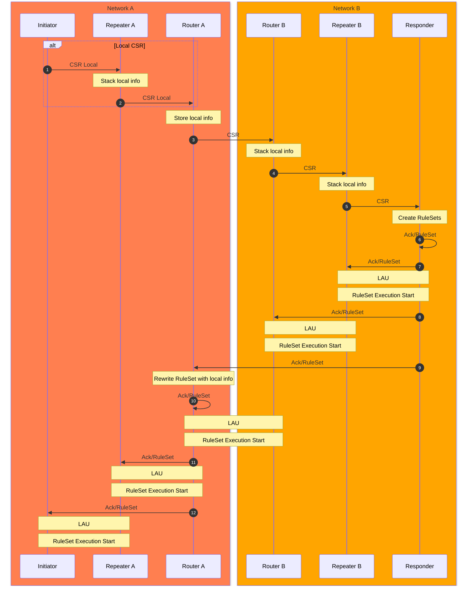

port 52244

LAU exchange list of connections and how to solve conflict of execution order

### 4.3 Connection Setup over multiple networks
> RuleSet rewriting
> Need to introduce recursive network architecture

If the initiator and the responder in the different networks, the RuleSets are also neccesary to be rewritten by intermediate routers.

## List of Contents
### Abstract
- [x] Introduce what is Connection Setup
- [x] Explain why we need it
- [ ] Mention RuleSet
- [ ] Explain how do we implement it

### Introduction
- [x] Introduce quantum communication
- [x] Introduce what is Connection Setup in detail
- [x] Explain what is the difference between classical scheme
- [x] Enumerate key concepts introduced in this document
- [x] Note for multipartite connection setup